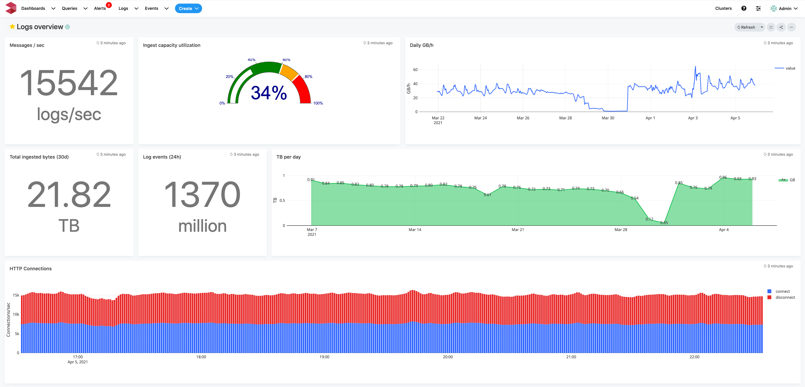

# Overview

## LOGIQ Insights

LOGIQ Insights is a complete observability platform for monitoring, log aggregation, and analytics with infinite storage scale. 

The LOGIQ platform comprises of a User interface, a [command line toolkit](https://logiqctl.logiq.ai), a monitoring stack for time series metrics and a log analytics stack for log data.

## Monitoring

LOGIQ's monitoring stack is powered by Prometheus. LOGIQ has it's own user interface and does not use Grafana. LOGIQ's monitoring stack also allows data from additional data sources like Elasticsearch, Postgres, MySQL, MariaDB, MongoDB, Athena etc. to be queried, analyzed and visualized.

## Log Insights

LOGIQ Log Insights is a comprehensive log aggregation stack. It allows users to ingest, organize, analyze and, search through log data. The Log Insights stack is unique in its ability to use any S3 compatible store as its primary data store.

It is best suited for ingesting log and time-series data directly into your S3 compatible store. The ingested data is written in an open format for ready consumption by other software. Examples of common uses are ingesting log and time-series data from Rsyslogd, Syslog, Syslog-ng, Logstash, Fluentd, Docker and ECS logging drivers, Kafka, influxDB etc.

The LOGIQ log ingest server is natively written in the Go programming language and compiles into a single binary. This makes it light enough to be bundled with any application stack. The server also can be configured to run in clustered, HA mode that can tolerate 1 or 2 node failures making it ideal for creating larger clusters.

## Communities

LOGIQ is a member of the CNCF

