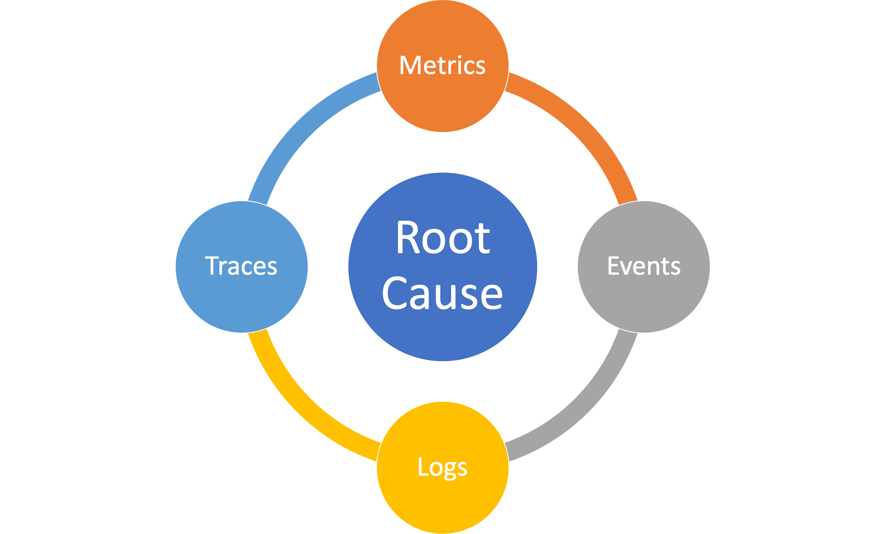
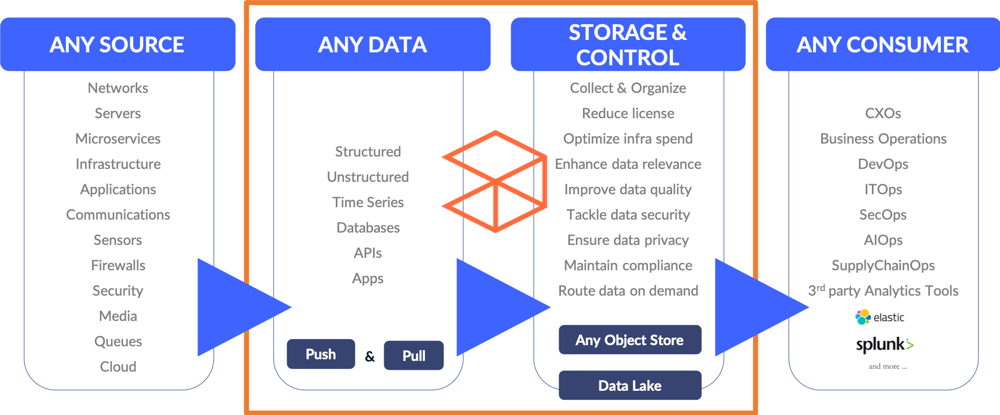

# Overview

## LOGIQ.AI Full-stack Observability Data Fabric

LOGIQ.AI is a full-stack observability data fabric that allows users to manage their entire observability data life-cycle: Collect, Store, Analyze, Transform, and Connect.

The LOGIQ.AI data fabric unifies observability data into a single platform by bringing data life-cycle management for (M)etrics (E)vents (L)ogs (T)races or frequently referred to as MELT data. Root cause analysis depends on an integrated approach to MELT data. For e.g. if you see an API performance issue with response time through a latency metric, the ability to drill down to the api trace next, followed by logs for a span that may show the issue becomes critical in faster root cause. Having MELT data sit in separate systems is one of the main reasons why root cause is slow in most observability implementations. They are built as specialized silos that don't talk with each other. LOGIQ.AI is an integrated platform that provides a consistent view of all MELT data for faster root cause outcomes.

Because LOGIQ.AI supports the full collection of Log Data, it also includes a built-in security monitoring layer for a log-based HIDS (Host Intrusion Detection System) that is compatible with OSSEC, Atomic, and Wazuh agents. In addition, LOGIQ.AI integrates rules from the open source Sigma project for SIEM rules. This makes the LOGIQ.AI data fabric an ideal first-mile solution to consolidate MELT and security monitoring data for your enterprise environments.

### Capabilities

LOGIQ.AI brings a unified view for your enterprise with its full-stack approach to observability data life cycle management. An integrated approach means it is easier to root cause issues as all the capabilities work together in an integrated manner.

.png>)

### Communities

LOGIQ.AI is a SOC 2 Type II Compliance platform and a member of the CNCF.

|  |  |
| ----------------------------- | -------------------------------------- |
