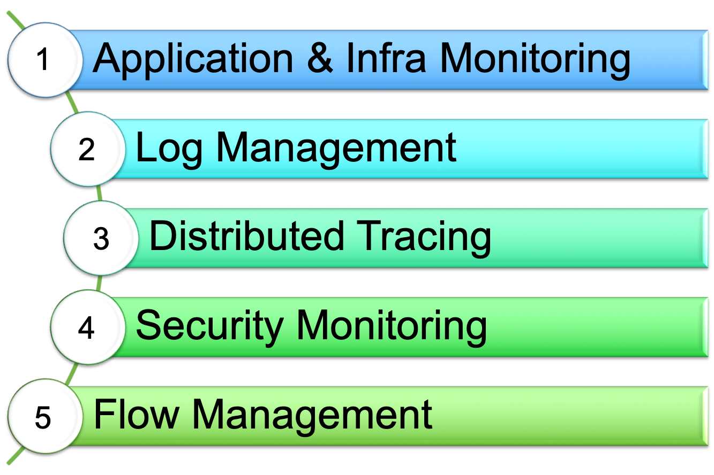

# Overview

## LOGIQ.AI Full-stack Observability Data Fabric

LOGIQ.AI is a full-stack observability data fabric that allows users to manage their entire observability data life-cycle: Collect, Store, Analyze, Transform, and Connect.

The LOGIQ.AI data fabric unifies observability data into a single platform by bringing data life-cycle management for (M)etrics (E)vents (L)ogs (T)races or frequently referred to as MELT data.&#x20;

Because LOGIQ.AI supports the full collection of Log Data, it also includes a built-in security monitoring layer for a log-based HIDS (Host Intrusion Detection System) that is compatible with OSSec, Atomic, and Wazuh agents. In addition, LOGIQ.AI integrates rules from the open source Sigma project for SIEM rules. This makes the LOGIQ.AI data fabric an ideal first-mile solution to consolidate MELT and security monitoring data for your enterprise environments.

### Capabilities

### Communities

LOGIQ is a member of the CNCF

