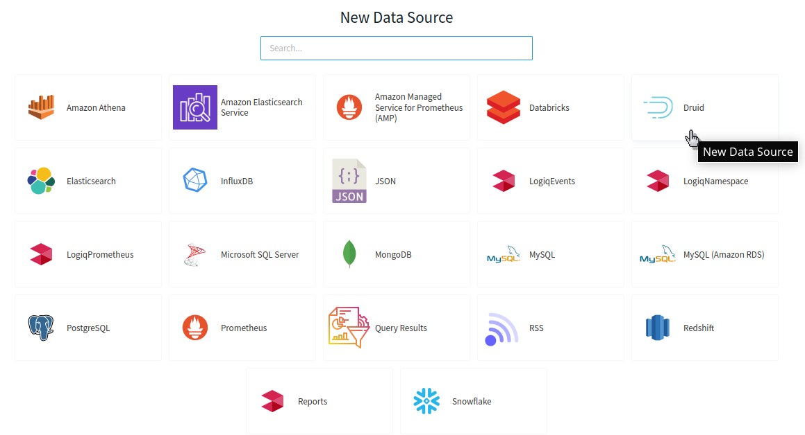
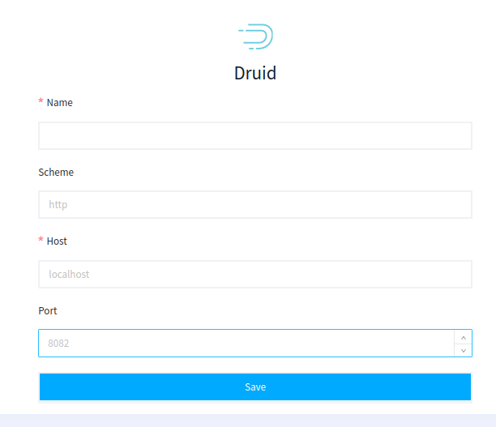

# Druid

**Apache** **Druid** is a real-time database to power modern analytics applications. Druid is designed to quickly ingest massive quantities of event data, and provide low-latency queries on top of the data.

**Apica Ascent** can connect to Druid to help you analyze your data.

### Adding Druid Data Source

The first step is to add Druid Data Source to your Apica Ascent. Fill out the below fields while configuring the data source

* **Name**: Name of the data source
* **Scheme (optional)**: HTTP/HTTPS scheme of your Druid instance
* **Host:** Host Endpoint point of your Druid Instance
* **Port:** Port address of your Druid Instance

That's all. Now navigate to the Query editor page and start Querying
