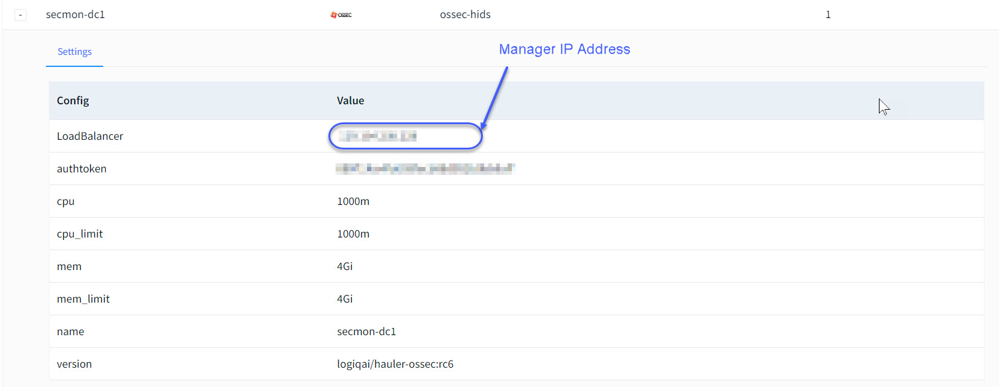

# OSSEC Variants (OSSEC/WAZUH/ATOMIC)

### Overview

Apica Ascent supports ingesting security events logs directly from OSSEC compatible agents. OSSEC (Open Source Security) is a powerful, open-source host-based intrusion detection system (HIDS) developed to detect and prevent malicious activities on systems. It has the ability to monitor all types of environments, including Windows, Mac OS X, Linux and Solaris systems. OSSEC works by monitoring the system.

The OSSEC architecture consists of three main components: the manager, the agent, and the local OSSEC server.

**The manager** is responsible for managing the agents, which monitor system activity and report back to the manager. The manager then compiles the agent reports, combines them with its own rules and tests, and alerts if there are any security issues.

**The agents** watch files, directories and network connections for changes or anomalies in data flow that could signify a malicious attack. Agents can detect attacks from worms, viruses, hacking tools, and more. The agent also looks for any unauthorized changes to critical system files or configurations that could indicate an attempted breach of security.

**The local OSSEC server** is responsible for analyzing the data from the agents and taking appropriate action depending on the type of attack detected. This can involve sending out alerts, blocking traffic, performing forensic analysis, and more.

OSSEC is an incredibly powerful tool that can be used to detect and prevent malicious activities on systems. It is an invaluable asset for any organization looking to secure their networks from threats both outside and within the company.

Apica Ascent takes over the functions of the manager and the local OSSEC server and makes it easy to bring together security related events into your data fabric for instant consumption.

### Starting the manager, ossec server

Launching the Apica Ascent OSSEC components is accomplished by launching the OSSEC Input _"App Extension"_ which can be found under _"Explore"_

<figure><figcaption><p>Launch the OSSEC HIDS components in Apica Ascent</p></figcaption></figure>

You can now provide the credentials that the agents can use to connect to Apica Ascent instance

<figure><figcaption><p>OSSEC Agent auth token</p></figcaption></figure>

* HostName - Enter a name for the app extension.
* AuthToken - The user chooses a 32-digit hex number, for example '2DAEF3165265A....FB793126B780BA4'.
* Resources - The user enters CPU and MEM usage limit, format adopted from Kubernetes resource notation - see explanation here, [https://kubernetes.io/docs/concepts/configuration/manage-resources-containers/](https://kubernetes.io/docs/concepts/configuration/manage-resources-containers/) Example setting, **`cpu/cpu_limit = 1000m`**, **`mem/mem_limit=4Gi`**.
* Version - Enters the image here. The latest Apica Ascent OSSEC component image can be browsed here, [https://hub.docker.com/r/logiqai/hauler-ossec/tags](https://hub.docker.com/r/logiqai/hauler-ossec/tags) Example image is '**logiqai/hauler-ossec:v1**'.

Shortly after the user configures all of the above, he will see the assigned _manager IP address_ appears in the display below. This IP is needed for setting up the agent next.

<figure><figcaption><p>OSSEC Manager Configuration Display</p></figcaption></figure>

### Wazuh agent installation

OSS (open source software) OSSEC/Automic agent variation Wazuh agent is used for capturing host observability data. Wazuh agent is better than the OSSEC agent in terms of performance, functionality and scalability. Wazuh agent has a better rules engine that is more efficient for large-scale deployments. It also offers enhanced logging capabilities with the ability to tag events and generate alerts in real-time. Furthermore, Wazuh can collect data from multiple sensors, such as Windows hosts, Linux systems, cloud platforms, and network devices.

Wazuh agent can easily be installed on both Linux and Windows platforms. Please follow the simple installation steps below,





### Configuring the agents

OSSEC/Automic OSS agent variation Wazuh agents can connect to the Apica Ascent instance using the agent-auth tool once after successfully installed. For Debian-style Linux distribution, the command below is used to link the agent to the manager.

<pre><code><strong>sudo /var/ossec/bin/agent-auth -m &#x3C;manager IP address> -p 1515 -P &#x3C;AuthToken> -A &#x3C;user-assigned agent name>
</strong></code></pre>

Windows system runs similarly from cmd or power shell window with Administrator privileges.

```
PS C:\Program Files (x86)\ossec-agent> .\agent-auth.exe -m <manager IP address> -p 1515 -P <AuthToken> -A <user-assigned agent name>
```

For Windows system we have a powershell script which can directly setup OSSEC agent. Please follow this [link](https://docs.logiq.ai/integrations/ossec-variants-ossec-wazuh-atomic/logiq-ossec-agent-for-windows) for Windows OSSEC agent setup.

### Enable automatic vulnerability scan at the endpoint

Wazuh agent supports automatic vulnerability scans, file integrity monitoring, and policy compliance features. With the Apica Ascent server manager activated, the platform will provide comprehensive visibility across the entire environment with centralized management of security policies and events.
