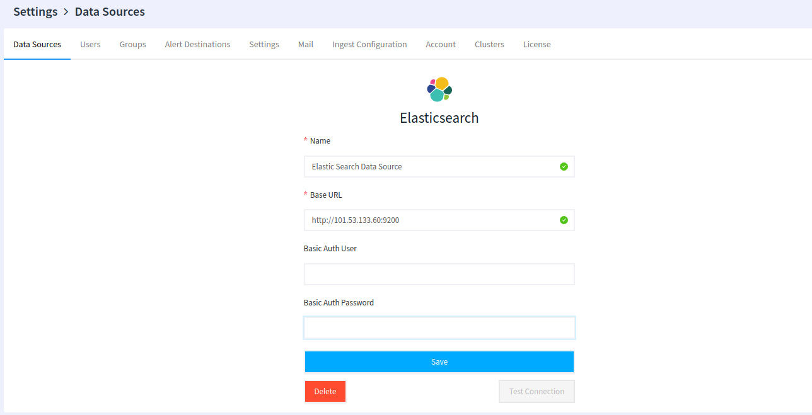
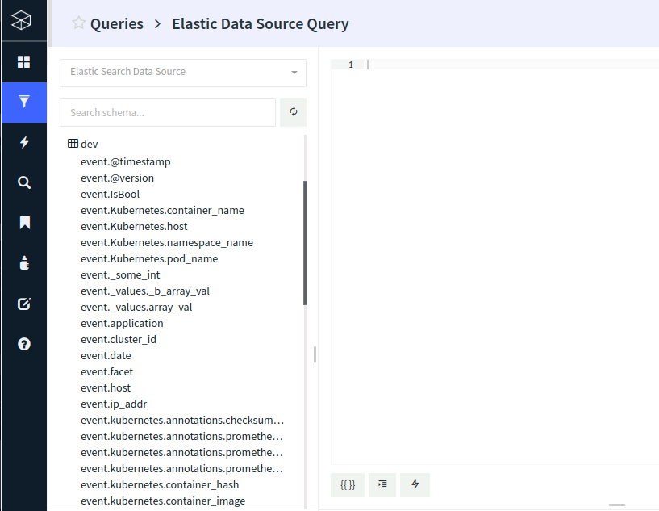

# Elasticsearch

## Create the Elasticsearch data source

The first step is to create the data source and provide the Elasticsearch cluster URL and optionally provide  the basic auth `login` and `password`.

## Writing queries

In the query editor view, select the _Elasticsearch data source_ created above. On the left column, click on the refresh  icon to refresh the schemes (indexes). The schemes are expandable and show the schema details.

You can then proceed to the query editor and run the search query. The query uses JSON as passed to the Elasticsearch search API

