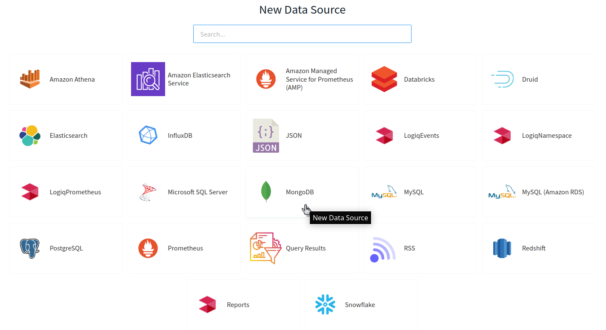
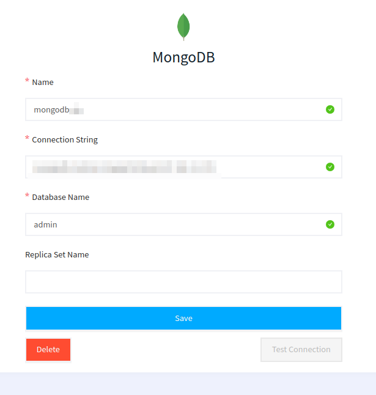

# MongoDB

LOGIQ lets you connect to your MongoDB for seamless Querying of data

### Adding MongoDB to LOGIQ

The first step is to create a MongoDB data source and provide all details such as the Name of the data source, Connection String, and the Database Name of your MongoDB. Optionally you can add Replica Set Name

### Querying MongoDB

The next step is to Navigate to the Query editor page and start Querying your data from your MongoDB

