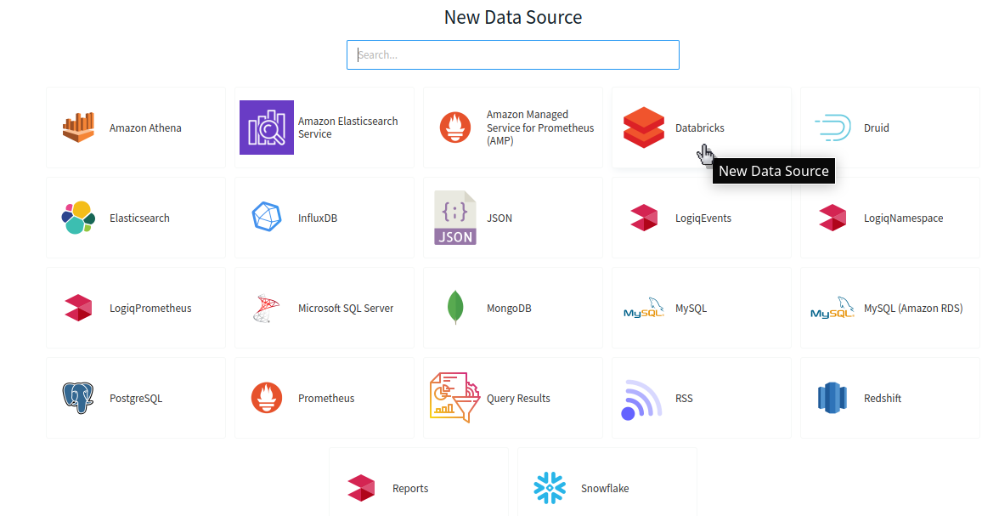

# Data Bricks

Apica Ascent can connect to your Data Bricks cluster and SQL Endpoints

### Adding Data Bricks to Apica Ascent

The first step is to obtain the **Host**, **HTTP Path**, and an **Access Token** for your endpoint from the Data Bricks. Refer to the below link to obtain the necessary information



The next step is to add Data Source in Apica Ascent using information obtained from the above source

That's it, now navigate to the Query Editor page and start querying
