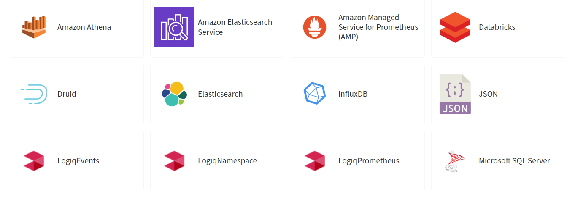
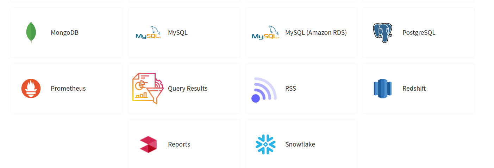

# Overview

LOGIQ supports SQL, NoSQL, Time Series and API data source along with LOGIQ's inbuilt data source to help you query data from different sources to help make sense of your data. Currently supported Data Sources on LOGIQ are shown below

