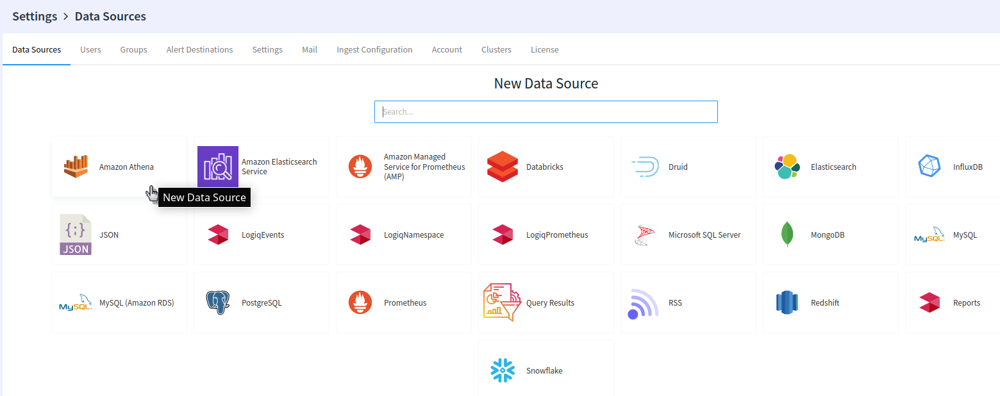

# Amazon Athena

### Setting up your Amazon Athena

The first thing you’ll need to do is create an IAM user that will have permission to run queries with Amazon Athena and access the S3 buckets that contain your data.

To configure your Amazon Athena with the necessary permission, please navigate to [https://docs.aws.amazon.com/athena/latest/ug/setting-up.html](https://docs.aws.amazon.com/athena/latest/ug/setting-up.html)

### Creating Athena Data Source 

After your Amazon Athena is configured, the next step is to create and add the Amazon Athena data source to your LOGIQ.

The next step is to fill out the details using the information from the previous step:

* **AWS Access Key** and **AWS Secret Key** are the ones from the previous step.
* **AWS Region** is the region where you use Amazon Athena.
* **S3 Staging Path** is the bucket Amazon Athena uses for staging/query results, you might have created it already if you used Amazon Athena from the AWS console - simply copy the same path.

\
That's it. Now navigate to the Query editor to query your data.
