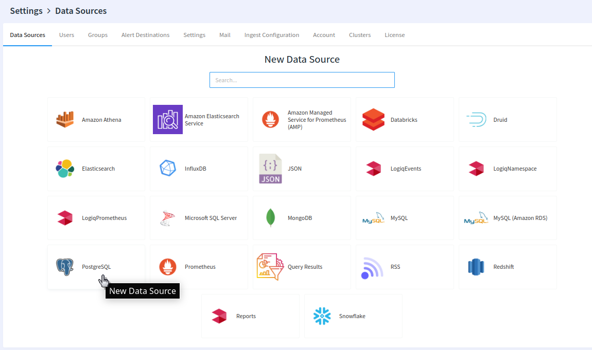
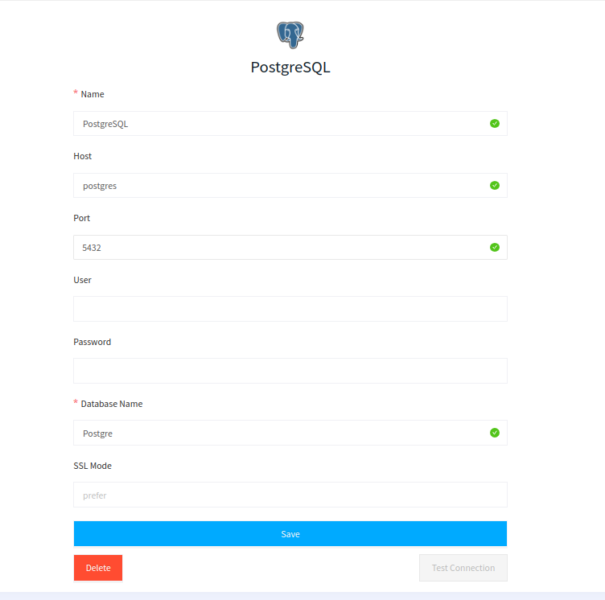
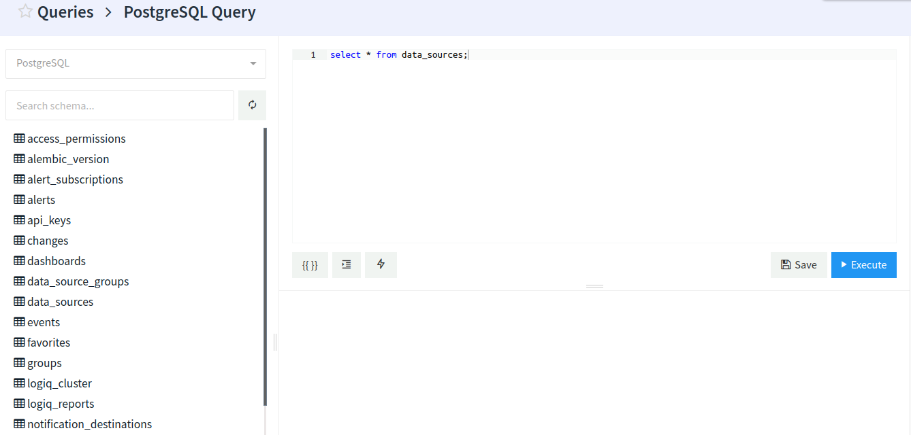

# PostgreSQL

LOGIQ lets you connect to your PostgreSQL easily and provides a rich Query editor to **Query your PostgreSQL** using its natural syntax.

&#x20;All your queried results are cached, so you don't have to wait for the same result set every time, also LOGIQ helps you to visualize your data gathered from queries.

### Adding PostgreSQL to LOGIQ

The first step is to create a PostgreSQL data source and provide all details such as the Host, Port, User, Password, and Database name of your PostgreSQL

### Querying your data

The next step is to Navigate to the Query editor page and start Querying your data from your PostgreSQL schemes

