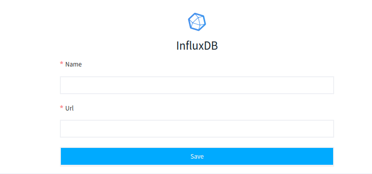

# InfluxDB

LOGIQ helps you to connect to your InfluxDB for analyzing and visualization of your data.&#x20;

### Adding InfluxDB data source

Fill out the Name of your Data source and URL of your InfluxDB and you are ready to query your data from the Query Editor page
