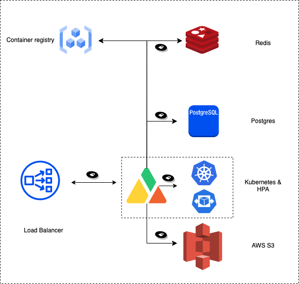

# PaaS Deployment Architecture

## Requirements

A production deployment of the Apica Data Fabric requires the following key components


1. **A Kubernetes cluster** to run the Apica Data Fabric software components. The Kubernetes cluster should provide&#x20;
   1. **A persistent storage class** that is used for transient/permanent storage by the software components in the data fabric
   2. **An optional ingress controller** integrated with the Kubernetes cluster to front the data fabric services. If an ingress controller is unavailable, the services in the data fabric are deployed as NodePorts that must then be programmed in **an optional external ingress provider** e.g. F5 etc.
2. **An object store** is where the data fabric stores its data at rest. An S3-compatible object store is required. If you are on Azure, you can take advantage of the native integration with the Azure Blob store which is not S3 compatible and needs bolt-on services.&#x20;
3. **Access to a container registry** for docker images for the Apica Data Fabric.
4. **A Postgres database** that stores all of the Apica Data Fabric configurations. If an external Postgres instance is not available, the deployment can be configured to deploy a Postgres instance along with the Apica Data Fabric software components.
5. **A Redis in-memory cache**. If an external Redis instance is not available, the deployment can be configured to deploy a Redis instance along with the Apica Data Fabric software components.
6. **Optional deployment of the K8S horizontal pod auto-scalar** to enable auto-scaling of Apica Data Fabric software components. If you do not use K8S HPA, not to worry, using standard scaling using `kubectl scale` is supported as well.

## Packaging

The deployment of the Apica Data Fabric is driven via a HELM chart.&#x20;

```
helm install apica --namespace apica-data-fabric apica-repo/apica 
```

The typical method of customizing the deployment is done with a `values.yaml` file as a parameter to the HELM software when installing the Apica Data Fabric HELM Chart.&#x20;

```
helm install apica --namespace apica-data-fabric apica-repo/apica -f values.yaml
```

***

## Reference Kubernetes Deployment Architecture

<div data-full-width="false">

<figure><figcaption></figcaption></figure>

</div>

***

## Reference AWS Deployment Architecture

<figure><figcaption></figcaption></figure>

***

## Reference Hybrid Deployment Architecture

The reference deployment architecture shows a hybrid deployment strategy where the Apica stack is deployed in an on-prem Kubernetes cluster but the storage is hosted in AWS S3. There could be additional variants of this where services such as Postgres, Redis, and Container registry could be in the cloud as well.

<figure><figcaption></figcaption></figure>

&#x20;
