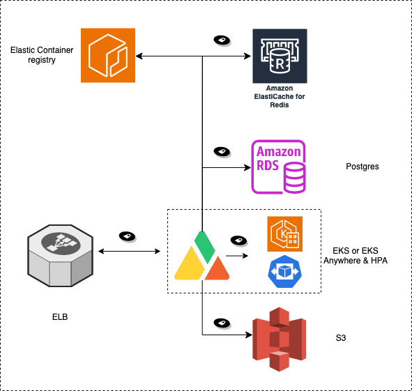

# Deployment Architecture

## Requirements

A production deployment of the Apica Data Fabric requires the following key components

1. **A Kubernetes cluster** to run the Apica Data Fabric software components. The Kubernetes cluster should provide&#x20;
   1. **A persistent storage class** that is used for transient/permanent storage by the software components in the data fabric
   2. **An optional ingress controller** integrated with the Kubernetes cluster to front the data fabric services. If an ingress controller is unavailable, the services in the data fabric are deployed as NodePorts that must then be programmed in **an optional external ingress provider** e.g. F5 etc.
2. **An object store** is where the data fabric stores its data at rest. An S3-compatible object store is required. If you are on Azure, you can take advantage of the native integration with the Azure Blob store which is not S3 compatible and needs bolt-on services.&#x20;
3. **Access to an image repository** for docker images for the Apica Data Fabric.

## Packaging

The deployment of the Apica Data Fabric is driven via a HELM chart. The typical method of customizing the deployment is done via a values.yaml file as a parameter to the HELM software when installing the Apica Data Fabric HELM Chart.&#x20;

## Reference Kubernetes Deployment Architecture

<figure><figcaption></figcaption></figure>

## Reference AWS Deployment Architecture

<figure><figcaption></figcaption></figure>

&#x20;
