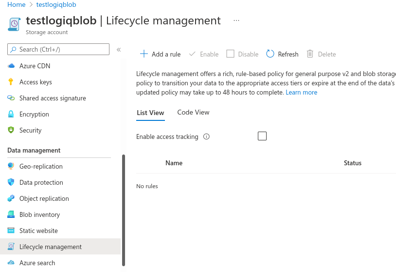
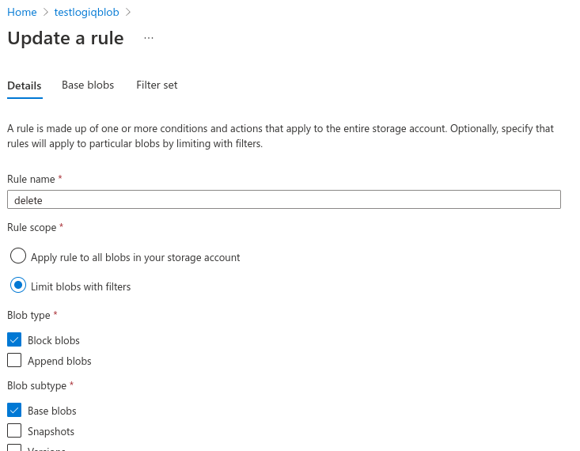
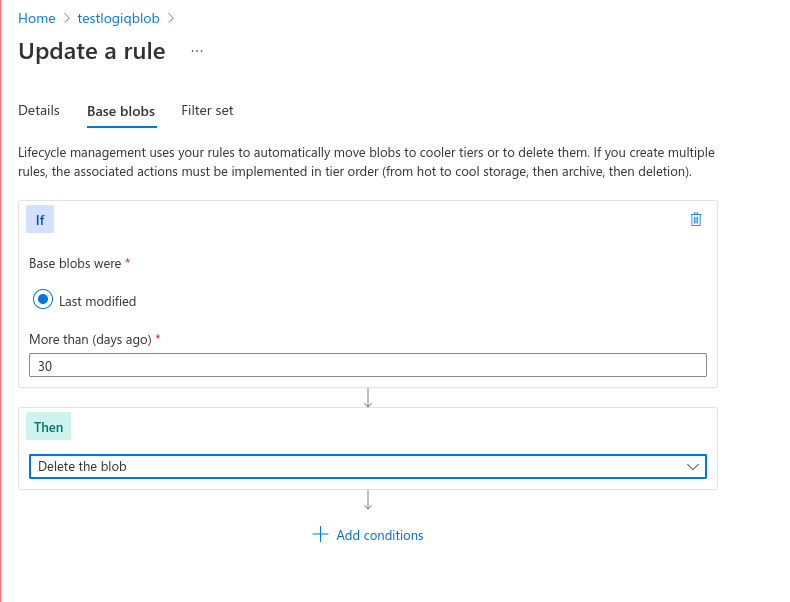
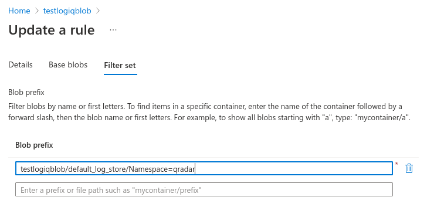

# Azure Blob Storage Lifecycle Management

Azure Blob Storage lifecycle management offers a rich, rule-based policy that you can use to transition your data to the best access tier and to expire data at the end of its lifecycle.

With the lifecycle management policy, you can:

* Transition blobs from cool to hot immediately when they are accessed, to optimize for performance.
* Transition blobs, blob versions, and blob snapshots to a cooler storage tier if these objects have not been accessed or modified for a period of time, to optimize for cost. In this scenario, the lifecycle management policy can move objects from hot to cool, from hot to archive, or from cool to archive.
* Delete blobs, blob versions, and blob snapshots at the end of their lifecycles.
* Define rules to be run once per day at the storage account level.
* Apply rules to containers or to a subset of blobs, using name prefixes or blob index tags as filters.

To enable life cycle policies in your Storage Account, click on Lifecycle management under the Data Management section. Click on "Add a rule"

Enter any rule name and select the below options

* Under Rule-scope, choose "Limit blobs with filters"
* Under Blob subtype, choose "Base blobs"

The below section allows you to choose the time you want to store the data for and actions you want to perform on the stored data, we have chosen to delete the data after 30 days.

* Choose "Delete the blob" option

The below section allows you to choose the prefixes that are needed to expire. Leaving it blank will expire the entire objects in the container.&#x20;

