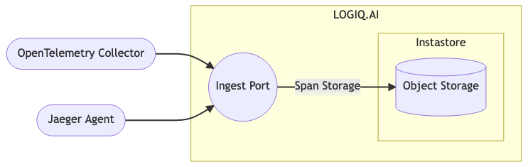

# Overview

Distributed tracing is a technique used to profile and debug distributed systems. A distributed system is a system where components are distributed across multiple machines. Distributed tracing allows you to trace the flow of a request as it goes through the different components of a distributed system. OpenTelemetry and Jaeger are two of the most popular distributed tracing tools.

Apica Ascent implements protocol endpoints to ingest directly from both Jaeger agent and OpenTelemetry collector while streaming and indexing the data to any object store. This makes the Apica Ascent implementation infinitely scalable for large volumes for trace data.

### OpenTelemetry

OpenTelemetry is an open-source project that provides a set of APIs and SDKs for instrumenting applications.

A few key points about OpenTelemetry:

* OpenTelemetry is designed to be vendor-neutral
* It offers APIs and SDKs for multiple languages
* It has an active community of contributors

### Jaeger

Jaeger is another open-source distributed tracing system..

A few key points about Jaeger:

* Jaeger was created by Uber
* It is written in Go
* It uses a distributed tracing model that is similar to Dapper

### Benefits

Benefits of using distributed tracing technologies:

1. Find performance bottlenecks
2. Debug errors
3. Understand the flow of a request through a distributed system.

Using distributed tracing can help your teams root cause issues faster. It's an area of increasing interest for developers and enterprises alike.
