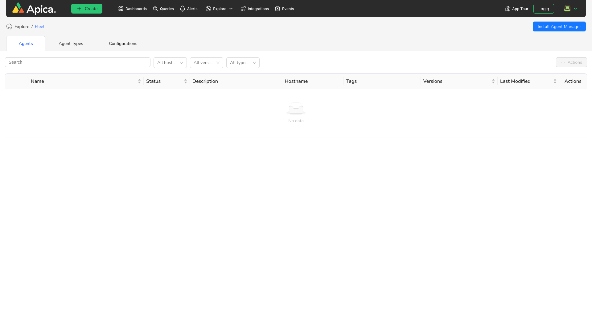
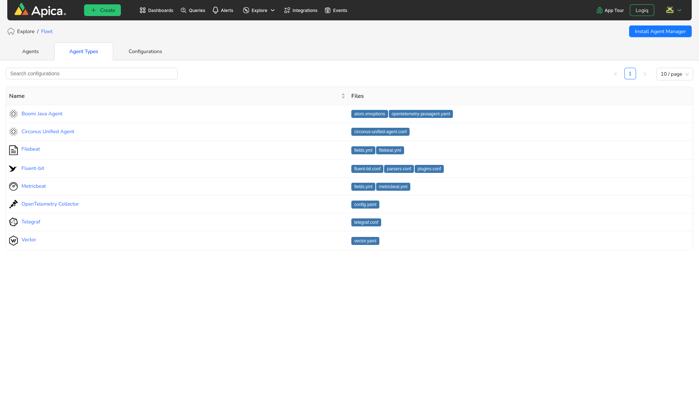

# Fleet Management Overview

With Fleet, you can collect more data when you need it and less when you don’t. And the best part? Almost all observability agents can be managed through configuration files describing how to collect, enrich and send data.&#x20;

Fleet aims to simplify this process through an agent manager. The Fleet Agent Manager functions as a sidecar utility that checks for new configuration files and triggers the appropriate restart/reload functionality of the supported agent. The Agent Manager is kept intentionally simple, with the goal that it only needs to be installed once and updated infrequently.&#x20;

Navigate **Explore > Fleet** will show the agent list that are configured and managed by the fleet.

<figure><figcaption>
Explore . Fleet
</figcaption></figure>

**No agents:**&#x20;

When there are no configured agents.

<figure><figcaption>
No agents
</figcaption></figure>

**Configured Agent List:**

This shows the all the configured agents. Filter the agents by name, host name, version and agent type. Actions menu provides Start, Stop, Restart and Delete option for an agent.

<figure><figcaption>
Agents list
</figcaption></figure>

**Agent Details:**&#x20;

Select any configured agents, then agent detail's view will show. Which has details and configuration files. The detail's view contains the description, tags, versions, agent created date and updated date. &#x20;

Configuration file's view contains the current active assigned configuration with the detail of the configuration.

<figure><figcaption></figcaption></figure>

**Configuration files:**

Select the configuration flies tab to view current active configuration that is assigned for the agent.

<figure><figcaption>
Active configuration
</figcaption></figure>

**Agent Status:**

Select the Status button to view the agent status, which shows logs/errors of the selected agent.

<figure><figcaption>
Agent status
</figcaption></figure>

**Configuration History:**

Click on the **Agent Assignment History** to view the assigned configurations for the agent.

<figure><figcaption>
Configuration history
</figcaption></figure>

**Assign configuration:**

Click on **Manually Assign Configuration** to assign configuration based on the selected agent type. Choose the configuration and assign it to the agent, then the agent manager will assign this configuration and restart the agent.&#x20;

Choose “Refresh” icon to view status of the assigned configuration.&#x20;

<figure><figcaption>
Assign configuration
</figcaption></figure>

**Supported Agent Types:**

The fleet platform comes with many agent types already set up, the ability to add custom agent types, and assign configurations to them all from the intuitive fleet UI.&#x20;

Some agent types such as the following come with the fleet enhanced low-code configuration building tool along with configuration uploads to help you build complex configuration files with ease.&#x20;

<figure><figcaption>
Agent types
</figcaption></figure>

**Configurations:**

Fleet makes it easy to manage your configuration files and agents all in one place. With fleet, you can import or create configuration files for your agents using the intuitive UI.&#x20;

&#x20; From the APICA UI, you can fully manage the life cycle of your agent’s various configuration files with built-in versioning whenever the file is first created or uploaded and throughout any edits or cloning.&#x20;

Configurations list: User can filter the configuration by name and agent types. Select any configuration to view content and update. To delete configuration, choose actions and select delete option.&#x20;

<figure><figcaption>
Configurations list
</figcaption></figure>

**Create new configuration:**

To create a new configuration, click on the **Create Configuration** button, a popup will appear. &#x20;

You can upload a local file or paste the configuration in the code block. Fill in the rest of the form and select **Create**.  Once the configuration file is imported, it will be displayed on the configurations list.&#x20;

<figure><figcaption>
Create configuration
</figcaption></figure>

#### **Update Configuration:**

To update select any configuration that you want to update, the update configurations popup will show. You can update the configuration and click on the Update button. &#x20;

&#x20;On update a new version of the configuration will be created instead of updating the configuration.&#x20;

<figure><figcaption>
Update configuration
</figcaption></figure>

#### Install an Agent using Agent Manager:

To install Fleet agent-manager on a host, click the blue "Install Agent Manager" button in the upper-left corner of the Agents tab. This will display the Install Agent Manager popup.

<figure><figcaption></figcaption></figure>

Select the Platform and Agent Type for the agent that you are installing.

Add any custom agent data attributes that are needed for this agent. Custom agent data can be referenced in Fleet configuration templates, and are used to contain agent specific information.

Click the Proceed button to generate the installation instructions README file, and a platform-specific installation script.

<figure><figcaption></figcaption></figure>

The install instructions and installation script can be downloaded. And, the installation script can be run on the host where agent-manager is to be installed, following the provided instructions.
