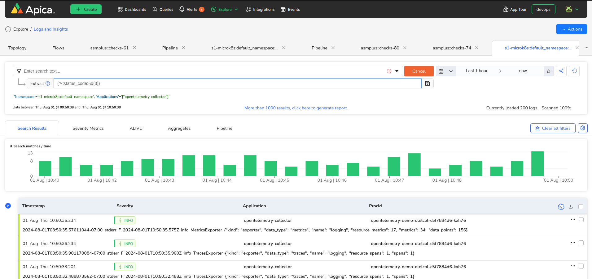

# STREAM

The Stream Rule allows you to clone and ship your logs to a new destination. You can change the namespace or/and the application name for your logs, and your logs will be cloned to the new destination. This rule comes in handy when isolating a certain set of logs for auditing. By using this feature, you can ensure that logs are duplicated and directed to a different namespace and application without disrupting the original log flow. This is particularly useful for maintaining a separate audit trail, where logs can be analyzed independently for compliance and security purposes. Additionally, this isolation helps perform thorough audits without interfering with the ongoing flow pipeline, providing a clear and uncontaminated log record.&#x20;

To create a Stream Rule, select a log line, click on the ellipsis button available on the log line, and select "Create Rule."

<figure><figcaption></figcaption></figure>

In the modal that opens after clicking "Create Rule," select "Stream" as the type of rule you want to create. Then, enter the necessary details for your Stream Rule, including a name for the rule, the group it belongs to, and any parameters needed to filter your log data.

Mentioning just the application name works, in this case, the original namespace will be retained and the cloned logs will be shipped with a new application name.\
In case you want to shift to a new namespace, the application name should also be changed.

<figure><figcaption></figcaption></figure>

### Pipeline View:

The Pipeline view, for the original set of logs, will contain the new branch of namespace/application branching out the Stream Rule node from the parent branch, indicating the cloning operation. Rules can be applied to the child branch( i.e. the cloned logs) as well. So if a stream rule is again applied to the cloned logs, there will be a new branch created from the Stream Rule node from the cloned logs. For pipelines with the Stream rule applied, there is an extra space indicator towards the right side of the pipeline view.

<figure><figcaption></figcaption></figure>
