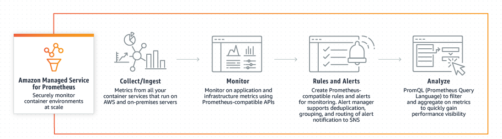
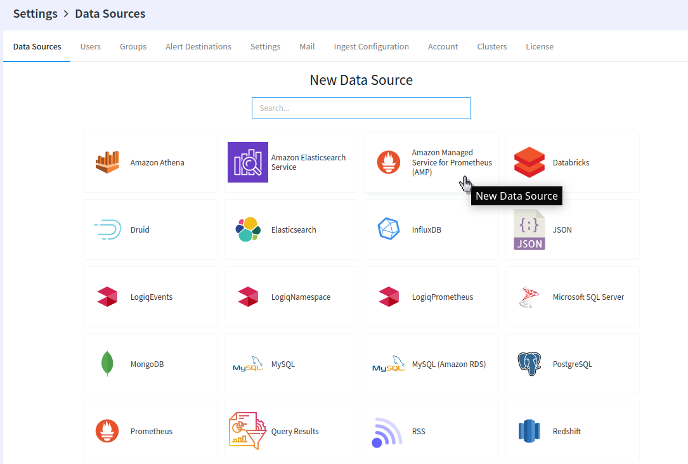
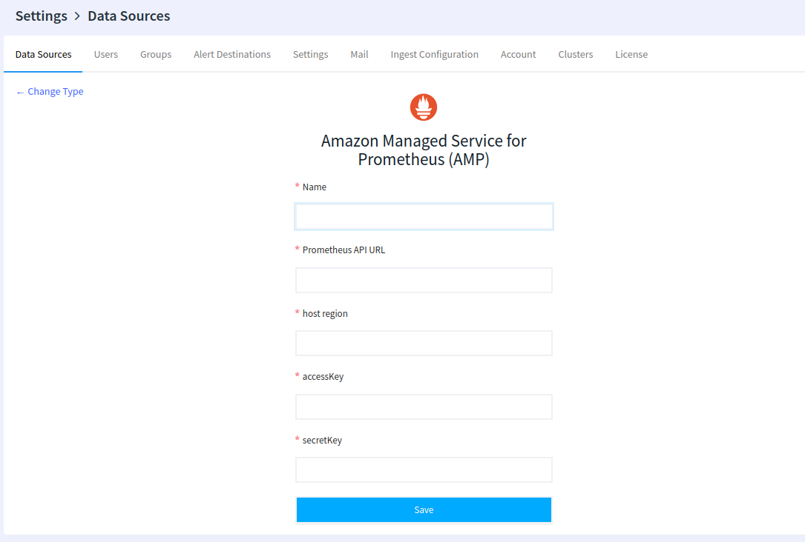

# Connecting Amazon Managed Service for Prometheus

**LOGIQ** Supports **Amazon Managed Service for Prometheus** data source which is a Prometheus-compatible monitoring and alerting service that makes it easy to monitor containerized applications and infrastructure at scale.

With Amazon Managed Service for Prometheus, you can use the open-source Prometheus query language (**PromQL**) to monitor and alert on the performance of containerized workloads, without having to scale and operate the underlying infrastructure.

The service is integrated with Amazon Elastic Kubernetes Service (Amazon EKS), Amazon Elastic Container Service (Amazon ECS), and AWS Distro for OpenTelemetry.

Now let us see how it works in brief with the help of an Image

### Create the Amazon Managed Service for Prometheus (AMP)  Data Source

Head over to the _Data Sources_ in settings. Settings can be accessed by clicking on the user name on the left navigation bar. The first step is to create the data source by clicking **Amazon Managed Service for Prometheus.**&#x20;

Provide all  the details and Save.

That is all! Now Read about how to query Prometheus data in the [PromQL](../querying-data.md) section.
