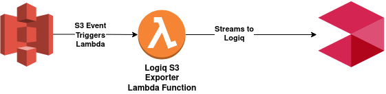

# AWS S3

## LOGIQ S3 exporter Lambda function




### Creating a Lambda function

LOGIQ provides a CloudFormation template to create the LOGIQ S3 exporter Lambda function.&#x20;

```
https://logiqcf.s3.amazonaws.com/s3-exporter/cf.yaml
```


You can also download the CloudFormation template from our [client-integrations](https://bitbucket.org/logiqcloud/client-integrations/src/master/cloudwatch-exporter/) GitHub repository.


This CloudFormation stack creates a Lambda function and its necessary permissions. You must configure the following attributes.

| Parameter     | Description                                                                                                                            |
| ------------- | -------------------------------------------------------------------------------------------------------------------------------------- |
| `APPNAME`     | Application name - a readable name for LOGIQ to partition logs.                                                                        |
| `CLUSTERID`   | Cluster ID - a readable name for LOGIQ to partition logs.                                                                              |
| `NAMESPACE`   | Namespace - a readable name for LOGIQ to partition logs.                                                                               |
| `LOGIQHOST`   | IP address or hostname of the LOGIQ server.                                                                                            |
| `INGESTTOKEN` | JWT token to securely ingest logs. Refer [here](../generating-a-secure-ingest-token.md#generating-using-ui) to generate ingest token.  |

## Configuring S3 trigger

Once the CloudFormation stack is created, navigate to the AWS Lambda function (`logiq-s3-logs-exporter`) and add a S3 trigger.&#x20;


On the **Add trigger** page, select **S3**. Next, select the **Bucket** you'd like to forward logs from and add a **Prefix**.


Once this configuration is complete, any new log files in the S3 bucket will be streamed to the LOGIQ cluster.
