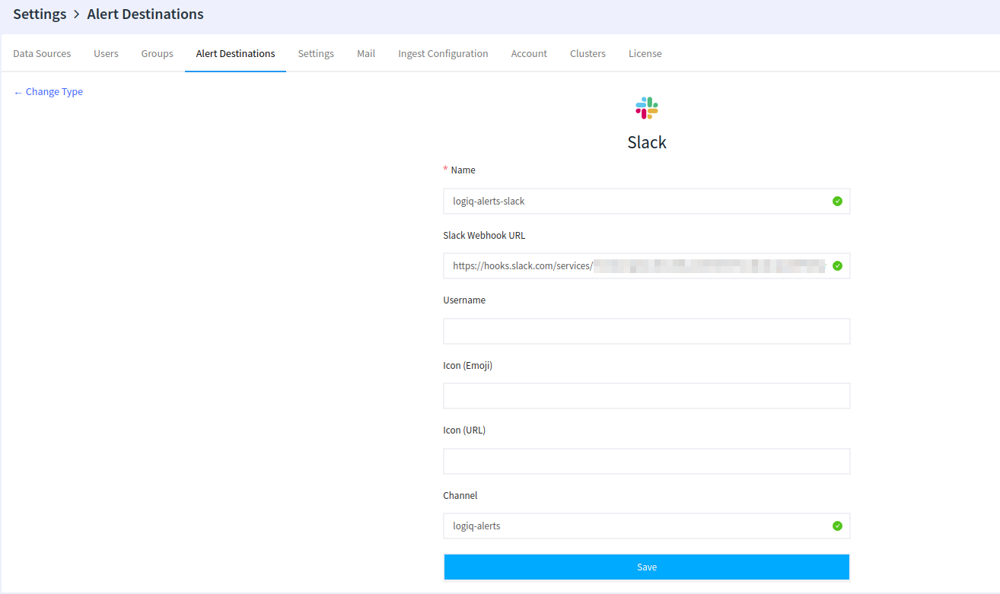
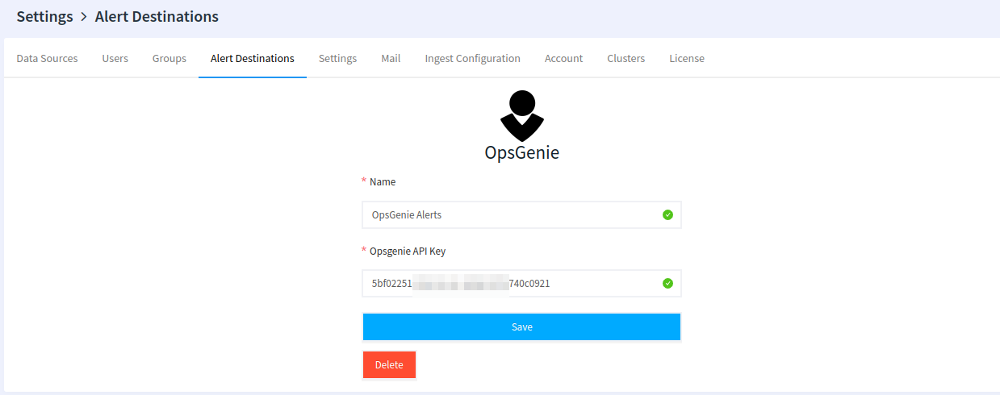

# Incident Management

When an alert triggers, Apica Ascent Insights sends alert details to its designated alert destinations. Apica Ascent Insights supports the following types of alert destinations.

* **E-mail**
* **ChatWork**
* **Generic Webhook (see** [**Webhooks**](./#slack) **page)**
* **HipChat**
* [**ilert**](../ilert.md)
* **Mattermost**
* **OpsGenie**
* **PagerDuty**
* **ServiceNow**
* **Slack**
* **Zenduty**

## Configuring Destinations

To configure alert destinations navigate to **settings** and open the **“Alert Destinations”** tab

### Email 


It’s required to [configure the e-mail](../../../logiq-ui-configuration/email-configuration-setup.md) server to receive e-mail notifications.


1. Click on + New Alert Destination”, and pick Email.
2. Specify the recipient’s name & email address.
3. The subject is configurable. It’s recommended to use format: **Alert {alert\_name} changed status to {state}.** alert\_name and state are template parameters and will be replaced by the URLs to give more information about the alert that will have occurred.

Email destination is created by clicking the save button.

### Slack 

In your [slack](https://my.slack.com/services/new/incoming-webhook/) console, pick or create a channel such as #alerts-events in this example and create an incoming webhook by clicking on "Add Incoming Webhooks Integration"

In your Apica Ascent Insight's UI, Open the “Alert Destinations” tab in the settings screen, and click on ”+ New Alert Destination”. Pick “Slack” as the type. Set the name, channel, etc, and provide a “Slack Webhook URL”, from above

### Pager Duty 

Obtain the PagerDuty Integration Key from your PagerDuty service. Use Events API v2 Integration Type.

After obtaining the Integration Key:

1. Open the “Alert Destinations” tab in the settings screen, and click on ”+ New Alert Destination”.
2. Pick “PagerDuty” as the type.
3. Populate mandatory fields are Name and Integration Key obtained earlier.

### OpsGenie 

In the OpsGenie UI, navigate to your **Teams** page and select the team for which you want to create the alert integration. In the example below we will use the logflow team.


NOTE: More than one OpsGenie alert destination can be defined in Apica Ascent


On the Teams page, select **Add integration** and create a new **REST API HTTPS over JSON** Integration type

Copy the API integration key from the integration created above.


The API Key must be created with **Read** and **Create and Update** permissions and must be **Enabled**


You are now ready to add the OpsGenie integration in Apica Ascent under alert destinations. Provide a name for the integration and the **OpsGenie API key**. You are now ready to receive incident notifications from Apica Ascent.

#### OpsGenie alerts view for Apica Ascent alerts

You can now see the alerts being raised in the OpsGenie UI under the alerts tab.

 

## Associating alert destinations to alert

Once the Alert destinations are created, one or more alert destinations can be configured in the alert create or edit UI. Each configured destination is notified whenever that alert triggers.

