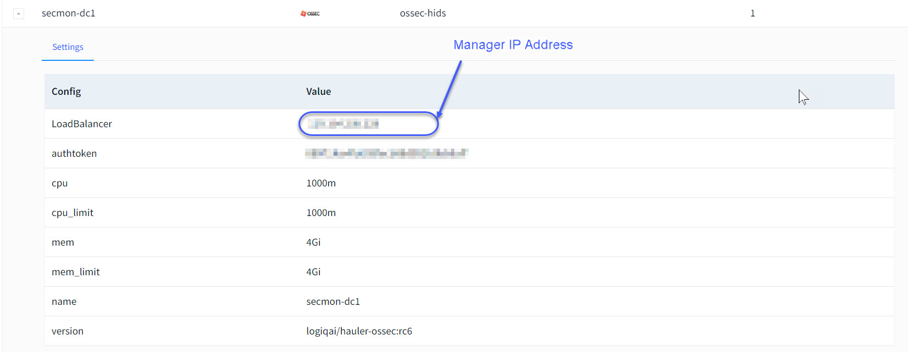

# Apica Ascent-OSSEC Agent for Windows

We have [discussed earlier](https://docs.logiq.ai/integrations/ossec-variants-ossec-wazuh-atomic) how to make a ossec`-hids` App Extension.

After creating a App Extension you can copy the **LoadBalancer-IP** and **authtoken** from the `Explore > App Extension` page.\\

After this, you are ready to connect the Apica-OSSEC Agent to the Apica-OSSEC Manager.\
\
Please download this powershell script file and run it from the source machine with 2 parameters.

Required Parameters:

* LOGIQ\_OSSEC\_MANAGER
* LOGIQ\_OSSEC\_PASSWORD

You can find these 2 values in `Explore > App Extensions > ossec-hids`.

**LOGIQ\_OSSEC\_MANAGER** is the **LoadBalancer-IP**.

**LOGIQ\_OSSEC\_PASSWORD** is the **authtoken**.

<figure><figcaption><p>LoadBalancer-IP and authtoken fields in App Extensions page</p></figcaption></figure>



You can run this powershell script like this.

> NOTE: Please replace the LoadBalancer-IP, and authtoken in the below command.

```
 .\logiq-ossec-installer.ps1 -LOGIQ_OSSEC_MANAGER "<Loadbalancer-IP>" -LOGIQ_OSSEC_PASSWORD "<authtoken>"
```

This script will run for approximately 20 seconds, you will be able to see that the Security events will be coming in the `Dashboard > Security Monitoring - Overview.`
