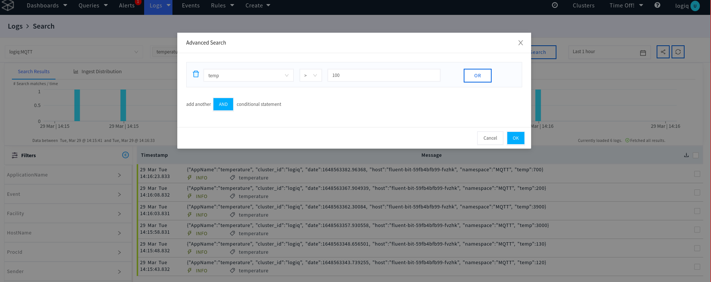
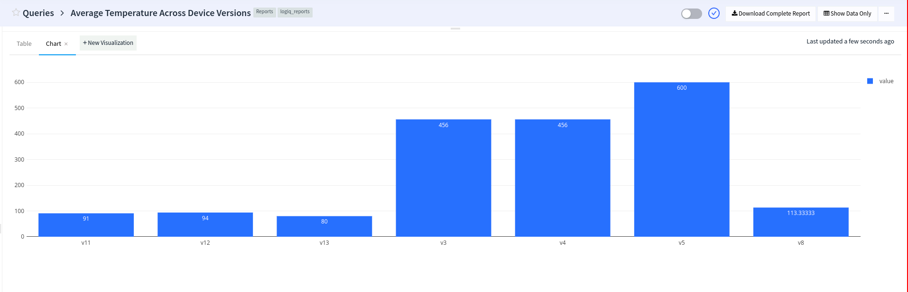

# MQTT

MQTT is an OASIS standard messaging protocol for the Internet of Things (IoT). It is designed as an extremely lightweight publish/subscribe messaging transport that is ideal for connecting remote devices with a small code footprint and minimal network bandwidth. MQTT today is used in a wide variety of industries, such as automotive, manufacturing, telecommunications, oil and gas, etc.

Apica Ascent can act as an MQTT broker to receive MQTT messages from IoT clients. This page describes how to send MQTT messages to Apica Ascent. Apica Ascent uses the 1883 port to receive MQTT messages. Connectivity can be tested using mosquitto\_pub command

```
mosquitto_pub -h endpoint.logiq.ai -p 1883 -t temperature -m '{"device_version": "v11", "temp": 92}'
```

Apica Ascent uses the incoming topic name from the messages to partition the data by default. This behavior is customizable.&#x20;





