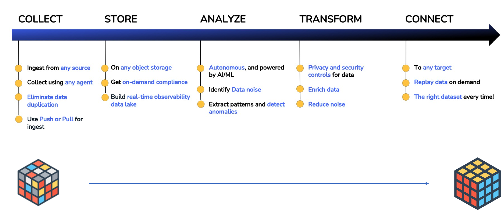
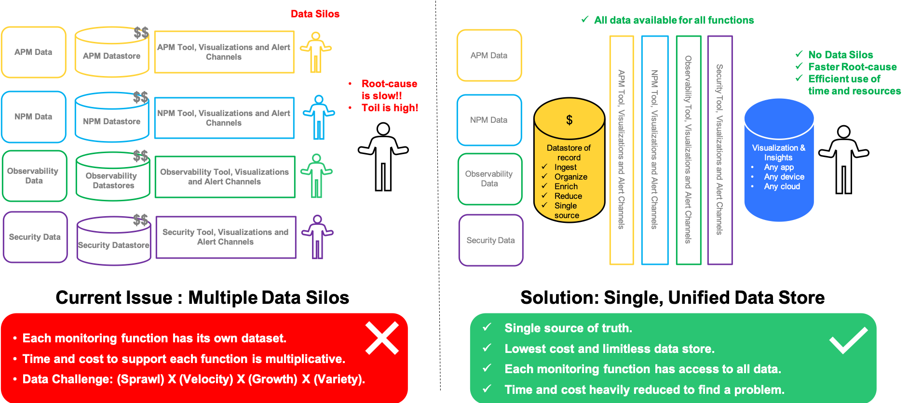
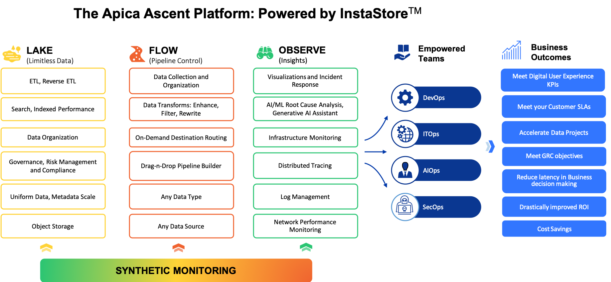

# Apica Ascent Overview

## Apica Ascent Data Fabric

Welcome to Apica Ascent, a powerful full-stack observability data fabric designed to streamline and optimize your entire observability data life-cycle: Collect, Store, Analyze, Transform, and Connect.

The Apica Ascent data fabric consolidates observability data into a single platform, specifically focusing on (M)etrics, (E)vents, (L)ogs, and (T)races, commonly known as MELT data. This integrated approach to MELT data is crucial for efficient root cause analysis. For example, if you encounter an API performance issue represented by latency metrics, being able to drill down to the API trace and accompanying logs becomes critical for faster root cause identification. Unlike traditional observability implementations, where data sits in separate silos that don't communicate, Apica Ascent ensures a cohesive view of all MELT data, leading to faster root cause outcomes.

In addition to its observability capabilities, Apica Ascent also includes a built-in security monitoring layer, acting as a log-based Host Intrusion Detection System (HIDS). The platform is compatible with popular agents like OSSEC, Wazuh, and Atomic, and incorporates rules from the open-source Sigma project for Security Information and Event Management (SIEM) purposes. This makes Apica Ascent's data fabric a reliable first-mile solution for consolidating MELT and security monitoring data within your enterprise environments.

<figure><figcaption></figcaption></figure>

### Capabilities

Apica Ascent employs a unified view of your enterprise, utilizing a full-stack approach to observability data life cycle management. By seamlessly integrating various capabilities, Apica Ascent facilitates a smoother and more effective root cause analysis process.

<figure><figcaption></figcaption></figure>

### Communities and Compliance

Apica Ascent takes pride in its commitment to security and compliance. The platform adheres to SOC 2 Type II Compliance standards and is an esteemed member of the Cloud Native Computing Foundation (CNCF).

|                                  |                                           |                                                                           |
| -------------------------------- | ----------------------------------------- | ------------------------------------------------------------------------- |
|  |  |  |
