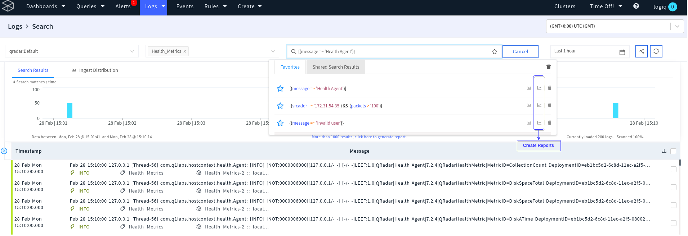
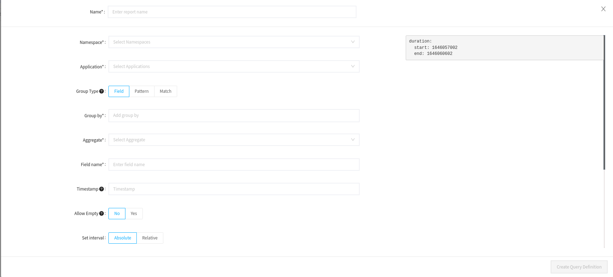
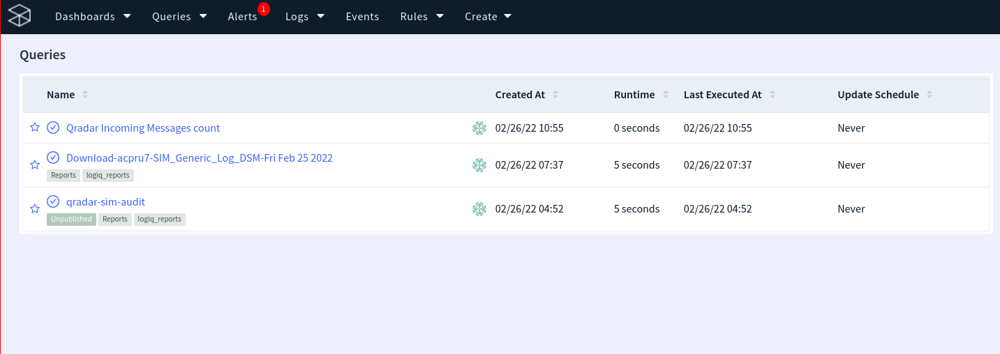
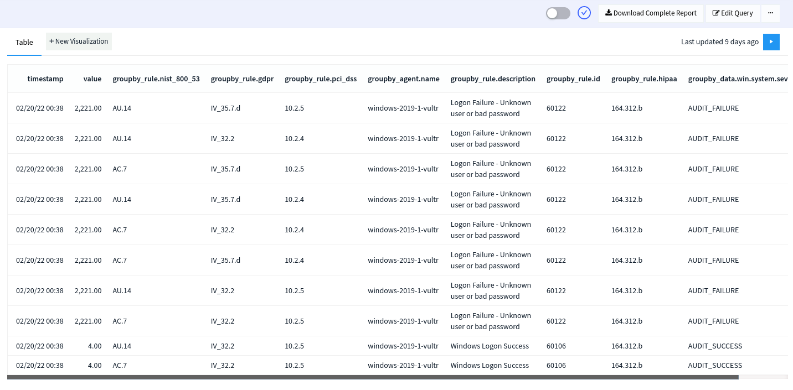

# Reports

Reporting feature comes in handy when required to periodically search and aggregate what is happening in a particular log set. You can create reports in multiple ways:

### Creating a Report

* From the logline, click on "create batch report"

 (1) (1) (1).png>)

* From the favourite searches



* From the create dropdown


Onclick of any of the above options opens the. "Create Reports" modal.



### Group By

Reporting feature lets you group the results by any fields available in the structured data or use any arbitrary regex named capture groups. To use fields from structured data, select the "Group Type" as "**Field**" To use regex named capture groups, select "**Pattern**". Logiq uses regular expression syntax accepted by RE2. Please refer to the [RE2 wiki](https://github.com/google/re2/wiki/Syntax) for detailed syntax. Select "**Match**" to download all the matched results.&#x20;



```bash
(?P<Year>\d{4})-(?P<Month>\d{2})-(?P<Day>\d{2}) 
# This extract Year(2011), Month(03) and Day(12) from a message like below
# flash test message 2021-03-12T19:40:08+05:30 #:25:# took=0.9647148s
```



```go
filePath:\s(?P<Path>[/.a-zA-Z0-9]+)
# This exreact Path(/ecp/default.aspx) from a message like below
# ... count=18 filePath: /ecp/default.aspx abcd
```



### Aggregation Operators

Following aggregation operators are available.

* sum
* count
* mean
* min
* max
* group

### View Results

Saved reports can be accessed from the Queries Page. If the query is running, this page will show the progress.&#x20;



Click on any report to view the results. Click on the toggle to enable periodic refresh.



### Visualizations

The results can be used to create visualizations. Click "New Visualization" to start visualizing the results.&#x20;

.png)

