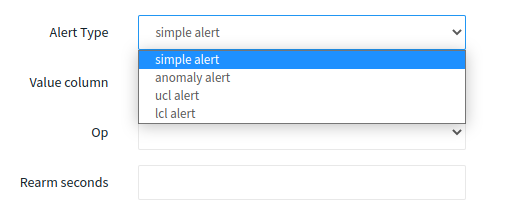

# Alerts (Simple/Anomaly)

## Create an Alert On Query

1. Press on the create header caret and select "Alert" to navigate to create a new alert page.
2. Choose the query that you want to base the alert on.
3. Select the type of alert you want to create. The available options will depend on the baselining features enabled on the query:

* **Simple alert**: This type of alert is visible by default and allows you to monitor for specific values or patterns in your query results.
* **Anomaly alert**: This type of alert is only visible if the anomaly detection AI/ML feature is enabled. It allows you to detect unexpected or unusual changes in your query results that may indicate a problem.
* **LCL or UCL** **alert**: This type of alert is only visible if the STD feature is enabled. It allows you to monitor your query results for values that fall outside of the upper or lower control limits, which can be helpful for identifying issues with data quality or process performance.
* **Week comparison** **alert**: This type of alert is only visible if the week comparison feature is enabled. It allows you to compare your query results to data from the previous week and raise an alert if there is a significant difference.

<figure><figcaption>
alert types drop down
</figcaption></figure>

4. Once you've selected the type of alert, you can configure the alert settings, which include the following fields:

#### Fields

* **Name**: A name for the alert, which should be alphanumeric.
* **Destination**: This is a user-specified selection where the alerts will be delivered. Only [user-defined alert destinations](../integrations/list-of-data-sources/alert-destinations.md) will be available for selection. Users can configure alert destinations in the Alert Destinations Section
* **Operation**: One of the comparators: `>,` `>=,` `<,` `<=,` `==,` `!=,` `=~,` `!~`
* **Reference:** Set the threshold value for the alert condition**.**
* **Rearm**: How frequently will you receive notifications when your query meets the alert criteria and does not change?  It must be a valid number of seconds (minimum 300 seconds).
* **Value Column:**  The data column upon which the alert is configured.
* **Selection Condition**:  One of the options `is Any, All, or None`.  Select "All" to alert only if all rows meet the condition. Select "Any" to alert if at least one row meets the condition.
* **Time Column **<mark style="background-color:purple;">**( optional )**</mark>: Select the time column if the data has a time column.
* **Track Duration **<mark style="background-color:purple;">**( enabled only if Time Column is provided )**</mark>:  Provide time in minutes to track the data in the given amount of minutes. If given "5m", it tracks the latest 5 minutes of data.

5. Once you have filled in the necessary fields, click "Save" to save and activate it to start monitoring your query results.

<figure><figcaption>
Simple Alert Configuration
</figcaption></figure>

The above picture is an example of an alert configuration that tracks the last 5 minutes of the column "value" and is triggered when any row of the data is greater than the value 1.5. If the time column is not selected entire dataset is tracked instead of the given track duration.

By following these steps and configuring the necessary fields, you can create and customize alerts to monitor your query results and detect potential issues before they become larger problems.
