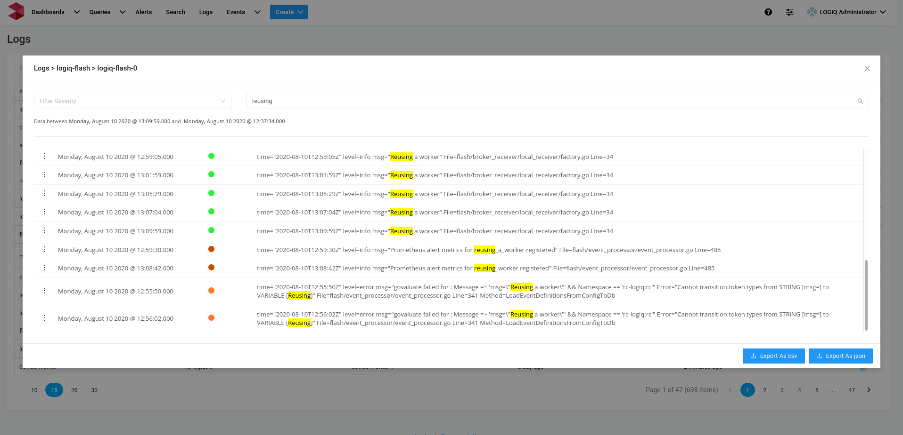
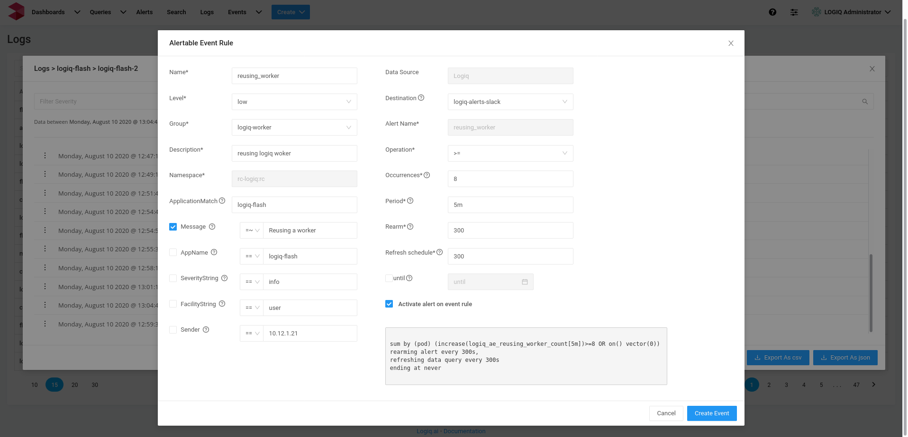
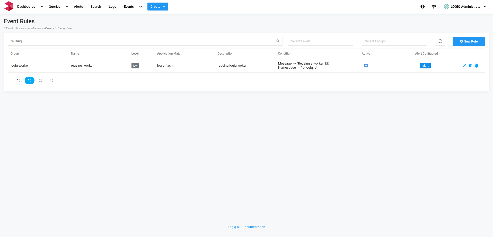

# Alertable Events

Alerts can be configured during event creation. Creating an alertable event will add an event rule and alert on that event. For example while scrolling through context logs or search logs, we want to get alerted if a particular event occurs multiple times during a given execution cycle, we can directly create an **alertable** **event** from that particular log line.

E.g., we want to receive an alert when a particular event \(_Reusing worker_ in above example\) occurs multiple times. On clicking the three dots at the starting of the log, we can open a modal window, fill in the details and alert is all set and ready.

### Creating an alertable event

#### Fields

* Name: name of the alert, should be alpha numeric.
* Level: one of the:  `low`, `medium`, `high` or `critical`
* Group: Select a predefined group or add a new.
* Description: Human readable description of the alert.
* Namespace: Auto populated and non editable field.
* Application Match: Auto populated field, editable and match could be a regex as well.
* Message: The expression on which events will get generated. Supports [RE2](https://github.com/google/re2/wiki/Syntax) regex.
* Application: Auto populated from the log line.
* Severity String: Auto populated from the log line.
* Facility String: Auto populated from the log line.
* Data Sources: Auto populated by the admin.
* Destination: where to deliver alerts, Destination need to be configured ins the Destinations page.
* Operation: One of the comparators: `>` `>=` `<` `<=` `==` `!=` `=~` `!~`
* Occurrences: number of time the event occurred, must be a valid number.
* Period: time over which the event occurred, e.g, `5m`, `10m`, `1h`, `1d`, `1w`. Period should be greater than `5m` \(`300s`\) and should be greater than or equal to Refresh schedule.
* Rearm: how frequently you will receive notifications when your query meets the Alert criteria and does not change, must be a valid number \(seconds\) minimum `300` seconds.
* Refresh Schedule: how frequently the query needed to be refreshed in seconds, must be a valid number.
* until: select when to stop the alerts. If not selected, the alert will never expire.

All the events created can be accessed at the events page and if the alert is configured on that event, it will be present as a column in the alert row.

Clicking on the the configured alert will open up the respective alert page where it can be editied to adjust the required values.

### Viewing Alerts

All the configured alerts are viewable at alerts tab. Individual alert can be edited on this page. 

