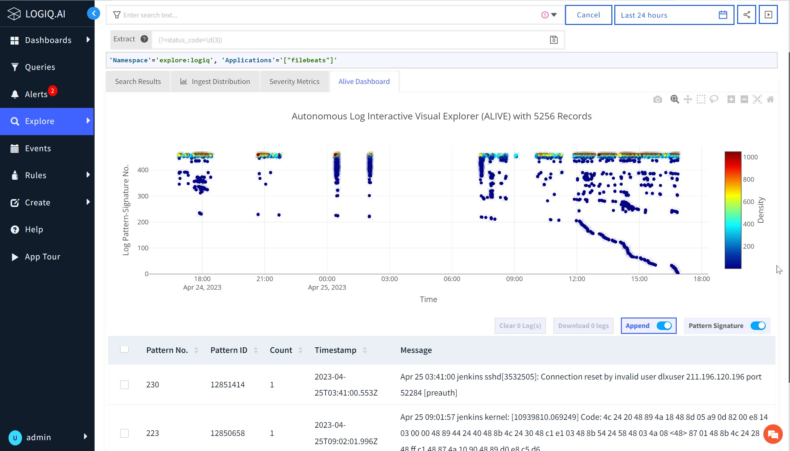
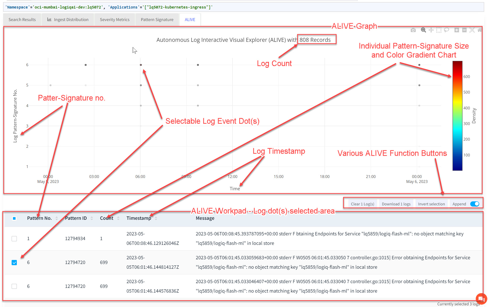
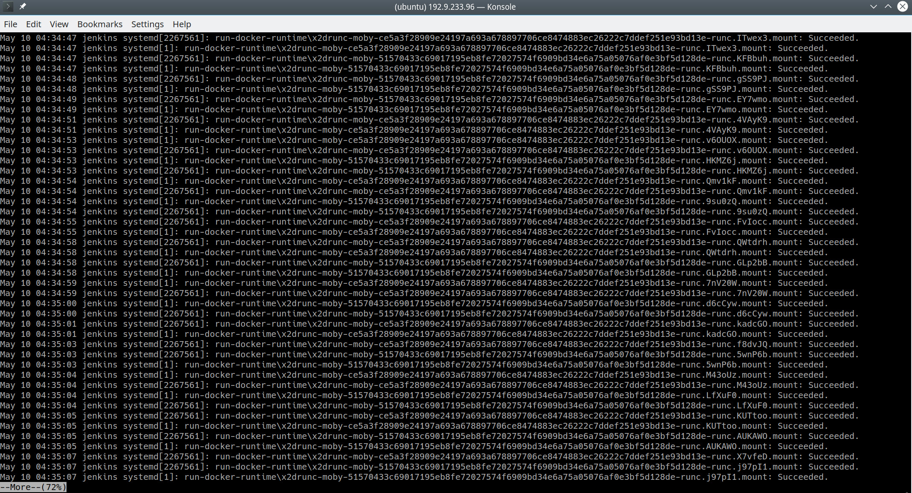
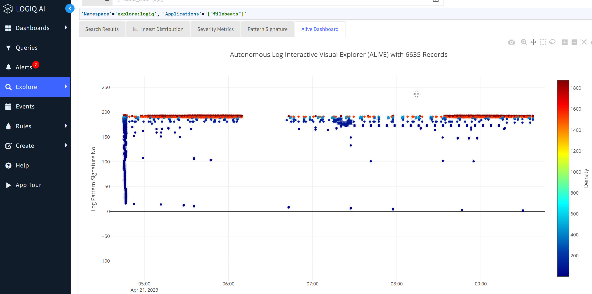
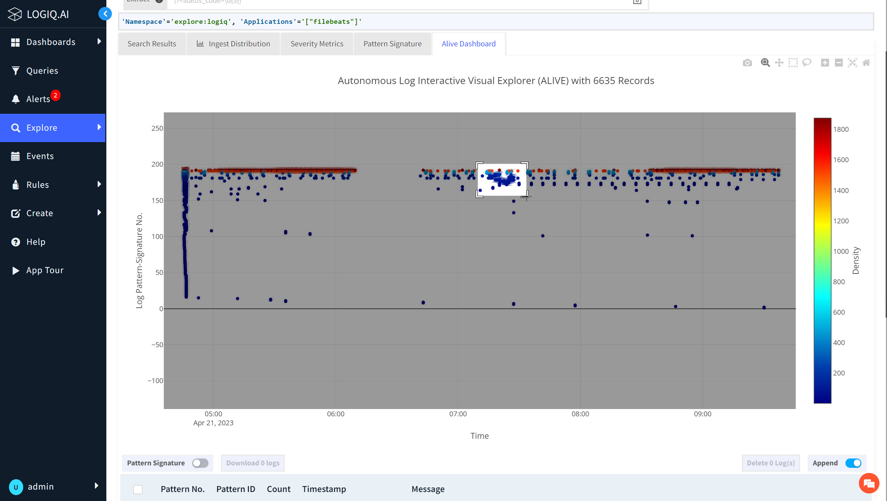
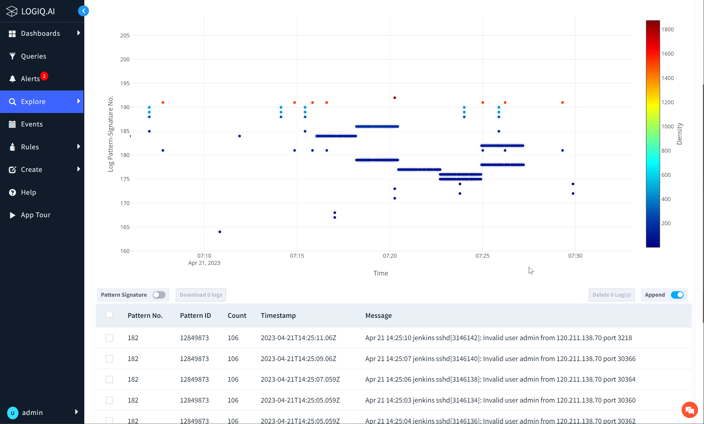

# Autonomous Log Interactive Visual Explorer (ALIVE)

## ALIVE Introduction

Computer logs have been around since the beginning of computers.  However, its usage is still maintained at the time it was introduced, where the user manually sifts through logs in text form using the user speculating log text patterns for hints.  The process of deriving answers from logs is painful.  Hence, companies have chosen the name to describe the process - Splunk, which took the name of describing the process of cave-exploring-like activity; tedious, long-time, and painful.   Sumo Logic company took the name and described the process as the Sumo wrestling-like approach; hard, laborious, and fast effort-draining. &#x20;

Logs analysis is a difficult problem due to its sheer volume and unlimited variety of forms.  Different log analysis techniques have been introduced to alleviate the pain. However, all up-to-date techniques are still around searches of known text patterns.  The known text patterns mostly come from the experience of domain experts or those that do the due diligence acquiring the knowledge about the logs. &#x20;

ALIVE (patent pending and patented) is introduced to elevate log analysis through a unique visual-interactive interface.  Users are no longer bound by traditional linear text representation of logs, and some ALIVE advantages are listed below,

* The ALIVE platform is created specifically to visualize a large set of logs, and it's big-data friendly. &#x20;
* The user can easily spot log anomalies in its unique visual log record arrangement.
* ALIVE provide methods for one to drill down into log details interactively, and the user no longer obeys the line-by-line text editor rule to access logs.&#x20;

Example ALIVE screenshot,

<figure><figcaption>
Example ALIVE Screen Shot
</figcaption></figure>

## ALIVE Setup and Quick Start

The first step is to enable log pattern generation capability for the desired namespace and application log stream.  The process to enable log pattern generation is described [here](log-pattern-signature.md#ps\_stream\_enable).

After enabling the log pattern-signature generator, one should see the incoming logs in the ALIVE visual logs arrangement. &#x20;

Steps to follow to access ALIVE UI,

1. Select the log stream namespace and application name for the analysis.\
   From the left-hand side, the main menu "Explore," select the namespace/app-name logs.
2. One should see itself in the search window after the previous action.  Click the "Log Interactive" feature at the top of the log list and the mid-right-hand side of the screen to open the ALIVE Window operating on the currently selected dataset.&#x20;
3. One can return to the previous "Search" window and navigate the pattern listing page by clicking the "Log Summary" feature button.

## ALIVE Graph Explained

ALIVE functions are described in the figure below,

<figure><figcaption>
ALIVE Anatomy
</figcaption></figure>

ALIVE Window is divided into two sections; graph and work pad.

At the top of the ALIVE window, the top portion is a graph of the time-series scatter plot of the explore log events mapped into scatter dots.  &#x20;

A temperature gradient on the right side of the graph shows the color mapped to the log's pattern signature count for the logs based on the entered log search criteria, such as time range or specific search pattern.&#x20;

Each one of the log records can be clicked and collected into the log work-pad space for further analysis.  The work pad logs can be selected for visually referencing the corresponding log DOT above or for removal.  &#x20;

There is a log select invert button in the ALIVE function control that one can use to invert the selected log for analysis visually or clear for sifting unwanted logs.

The title on the top of the ALIVE graph shows the number of logs being processed for ALIVE.

The bottom of the work-pad area shows the total number of logs selected for manual analysis.  The user can also download the work-pad logs using the download button in the ALIVE function control area.

## Example ALIVE Use Case

Linux Syslog is known for being difficult to analysis to its non-standard, unstructured, and abundant information content.  In a usual scenario, the user who is never willing to examine the Syslog log always needs to spend time understanding each log line and a section of logs as a whole.   The process is painful because the helpful hints can only be extracted from all the encrypted logs.  The user's first challenge is to overcome the mechanics, e.g., collect, find, and align logs.  After that, stare at the logs and hopefully find the relevant pattern or related messages. &#x20;

An example conventional text viewer is used to displaying endless lines of logs below,

<figure><figcaption>
Subject Logs for Investigation
</figcaption></figure>

&#x20;

Using ALIVE to view the above logs, one can immediately spot a logging pattern anomaly that appeared in the middle of the time period.

<figure><figcaption>
ALIVE Showing Logging Anomaly
</figcaption></figure>

Further, drill down into the log display using the ALIVE visual interactive features.

<figure><figcaption>
Zoom-in into the Anomalous Region
</figcaption></figure>

An additional action that the user can do is to collect and examine all the relevant logs in the work-pad display areas.  Notice that the anomalous logs show that the external source is port-scanning the device as it is trying to _ssh_ into the device using guessed parameters.

<figure><figcaption>
Log Investigation
</figcaption></figure>
