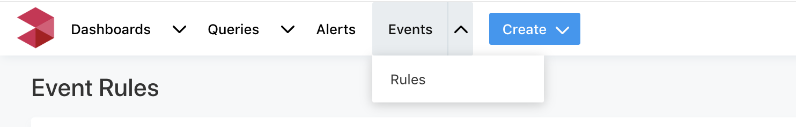
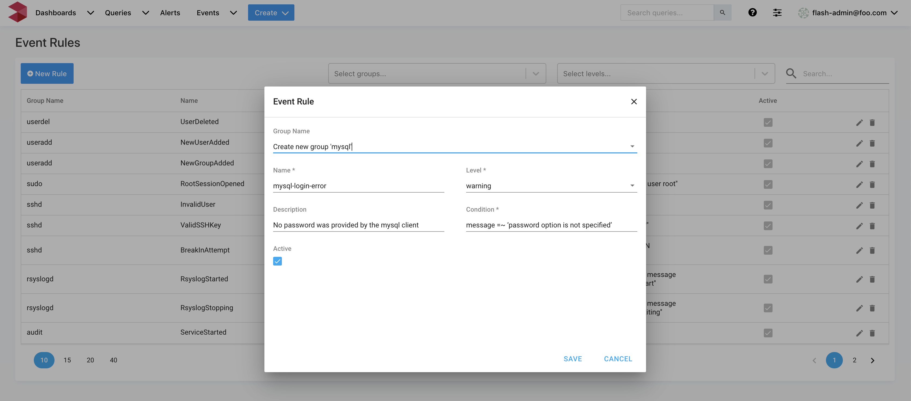

# Event Rules

## Event Rules UI

To access event Rules UI, click on "**Events**" menu and pick "**Rules**" option as shown in the screenshot below.



## Viewing Event Rules

The Event Rules page lists all the available rules in the LOGIQ server. Each rule consists of the following:

* **Group**: Denotes logical grouping of event rules. Typically, but not necessarily, it is the application or service name.
* **Name**: Unique name to identify the event rule.
* **Level**: It can be one of _**"Info", "Warning" or "High"**_.
*  **Application Match:** The condition on which the event will be triggered. Supports regex matches.
* **Description**: A human-readable description of the event.
* **Condition**: An expression applied to ingested data. Events are triggered when the boolean condition  evaluates to "True". Please see refer to [Writing condition expressions](event-rules.md#condition-expression-syntax).
* **Active**: This field indicates whether the event rule condition is enabled and has to be applied to the incoming data. Rules that are inactive are ignored.
* **Alert Configured:** If an alert is configured on the event, this field will have a link to that alert.
* **Actions group:** This offers a quick way to delete, edit or configure an alert on the event

Out of the box, the LOGIQ server comes with commonly needed system defined Event Rules. The built-in rules cannot be modified or deleted. However, they can be made active / in-active if required.


## Creating a new Event Rule

The Event rule creation screen is launched by clicking on _**"New rule"**_ button. Please refer to [Viewing Event Rules](event-rules.md#viewing-event-rules) section above for details about each of the parameters needed to create new event rule. If the rule does not belong to any of the existing groups, a new group is created. 



## Using Filters

Event Rules can be searched and narrowed down by using filters such as Level and Group Name.


## Writing condition expressions

Condition expressions can be created using the below attributes and operators

### Syslog data attributes for condition expressions

The attribute values are of type string unless otherwise specified

* severity, Severity
* facility, Facility
* app\_name, appname, Appname, AppName
* timestamp, Timestamp
* message, Message
* host\_name, hostname, Hostname, HostName
* groupings
* tag

### Condition expression syntax

* Modifiers: `+` `-` `/` `*` `&` `|` `^` `**` `%` `>>` `<<`
* Comparators: `>` `>=` `<` `<=` `==` `!=` `=~` `!~`
* Logical ops: `||` `&&`
* Numeric constants, as 64-bit floating point \(`12345.678`\)
* String constants \(single quotes: `'foobar'`\)
* Date constants \(single quotes, using any permutation of RFC3339, ISO8601, ruby date, or unix date; date parsing is automatically tried with any string constant\)
* Boolean constants: `true` `false`
* Parenthesis to control order of evaluation `(` `)`
* Arrays \(anything separated by `,` within parenthesis: `(1, 2, 'foo')`\)
* Prefixes: `!` `-` `~`
* Regex comparators `=~` `!~`

## Examples

```text
-
  name: BreakInAttempt
  description: POSSIBLE BREAK-IN ATTEMPT!
  condition: message =~ 'POSSIBLE BREAK-IN ATTEMPT'
  level: high
```

