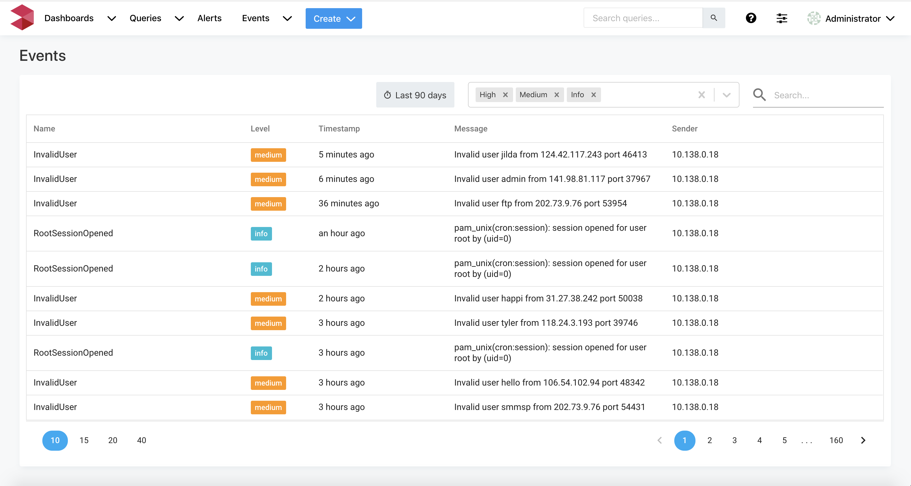

# Events

### Events UI

Events are shown in the user interface in the Events tab.

It is easy to narrow down and search for events that you care about using search and filtering

### Event rules

Events are captured based on _**event rules**_. Many event rules are built into LOGIQ. For customizing this further, we provide a simple UI to add new rules into the system.

See section on [Event Rules ](event-rules.md)for further information.

