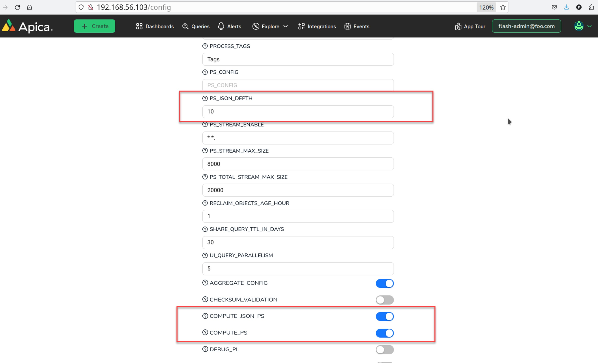

# Config JSON PS

### JSON Log PS Configuration

JSON PS setting is shown at the ingestion general setting menu below,

<figure><figcaption></figcaption></figure>

#### COMPUTE\_JSON\_PS, COMPUTE\_PS

<table><thead><tr><th width="167">CMP_JSON_PS</th><th width="102">CMP_PS</th><th width="325">Description</th></tr></thead><tbody><tr><td>Off</td><td>Off</td><td>No PS generated (Everything is PS3)</td></tr><tr><td>Off</td><td>On</td><td>
(default behavior)

Generic PS generation method for all incoming logs
</td></tr><tr><td>On</td><td>Off</td><td>JSON pattern only and none JSON logs get PS3</td></tr><tr><td>On</td><td>On</td><td>JSON logs goes to JSON ps and non-JSON goes to generic PS</td></tr></tbody></table>

#### **PS\_JSON\_DEPTH**

The maximum depth limitation the JSON log clustering method looks into for each JSON log.  &#x20;

Zero(0) is set for no maximum depth limitation. &#x20;

The default maximum matching depth is set to three(3).
