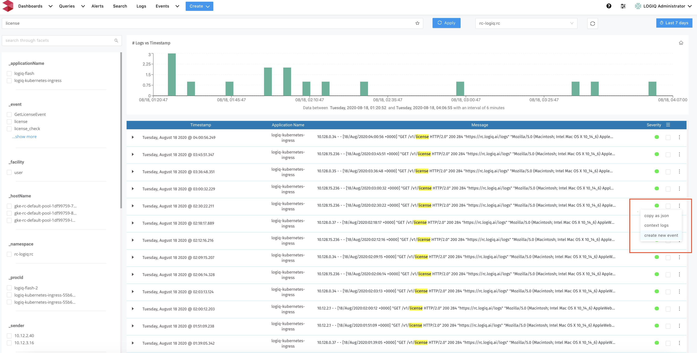
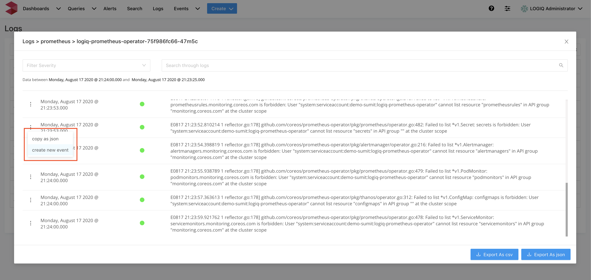
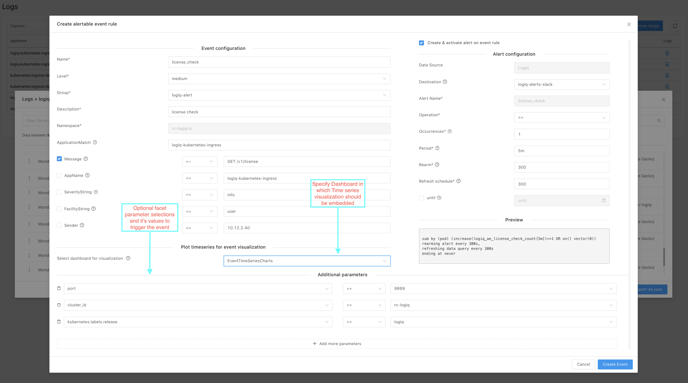

# Logs to time series event visualization

With LOGIQ insights in matter of a few clicks you can create time series visualizations for events that matter for effective monitoring. This section describes the details on how to create visualizations from logs or search pages.

You may choose to create a dedicated dashboard for event time series visualizations. Click on "create" and choose "dashboard".

Proceed to logs tab or search tab. Once the log-line is narrowed down either from search page or from logs page, LOGIQ Insight’s event user interface makes it almost effortless to generate events, alerts and visualizations for efficient monitoring of your infrastructure.

From the search UI, choose a log-line which is of the interest to generate events, and/or alerts and/or visualization. On the right hand side of the log-line click on “create new event”

Similarly, You may choose to find the log-line of interest from Logs UI. On the left hand side of the log-line click on “create new event”

This pops up “Create alertable event rule” modal window. It enables user to

* **Create an event rule**
* **Create corresponding Visualization**
* **Create Alert trigger \(optional\)**

Events are generated when a log-line satisfies event rule criteria. Event rule consists of a list of  key, operator and value combinations that could be connected by AND, OR.  Combination can consist of a few standard parameters such as Message, Application, Severity String, Facility String, sender and some facet parameters which are specific to that log-line.

In this example event is generated when a message matches “GET /V1/license” and other additional parameter criterions are met. And each triggered event is recorded by LOGIQ insight in the time series database. It helps generate a visualization graph of the events frequency with respect to time. It can be found in the queries page as license\_check query and license\_check-vis visualization.  
****

Since the dashboard “EventTimeSeriesCharts” is selected in the above example the visualization will be embedded in that dashboard. Click on dashboard and pick ”EventTimeSeriesCharts”

If required by selecting the checkbox “create and activate alert on event rule” and specifying preconfigured destination for notifications the alert trigger is conveniently created.

