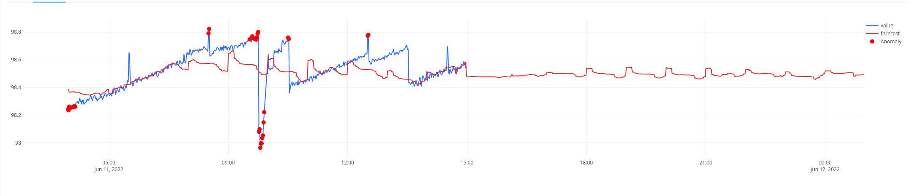
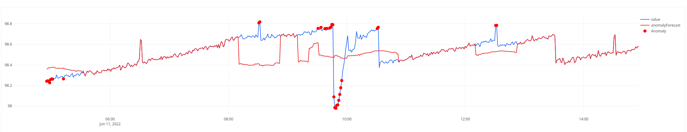

# Forecasting

Forecasting determines the forecast of the graph given based on mathematical regression techniques. This feature appends two columns to the dataset, AnomalyForecast, and forecast. AnomalyForecast is a local forecast of the data where the data seems anomalous. The forecasting is done for the window selected in the forecasting configuration. This feature uses catboost regression analysis to compute results.

#### Steps to configure standard deviation for a query:

1. Open a query page in edit query mode.
2. Select a meaningful time-series column and a value column.
3. Select the forecasting option from the operations selection box.
4. The forecasting configuration box appears. This has two sliders namely hours and minutes. Use the sliders to create a time segment in the future for future forecasting.
5. The resulting dataset contains two columns forecast and anomaly-forecast.

#### Steps to visualize the Forecasting:

1. Create a new visualization or open an already existing visualization in edit mode.
2. Select the chart type as a line for better visualization.
3. Select the time column as the X column and the value column as the Y column. Add the standard deviation columns i.e; forecast and anomaly-forecast, into the Y column multi-selection box. A graph similar to the following picture must be rendered.

