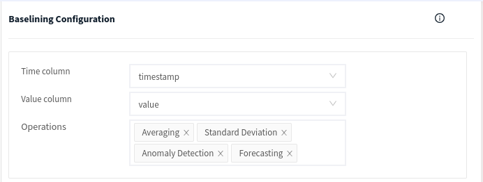
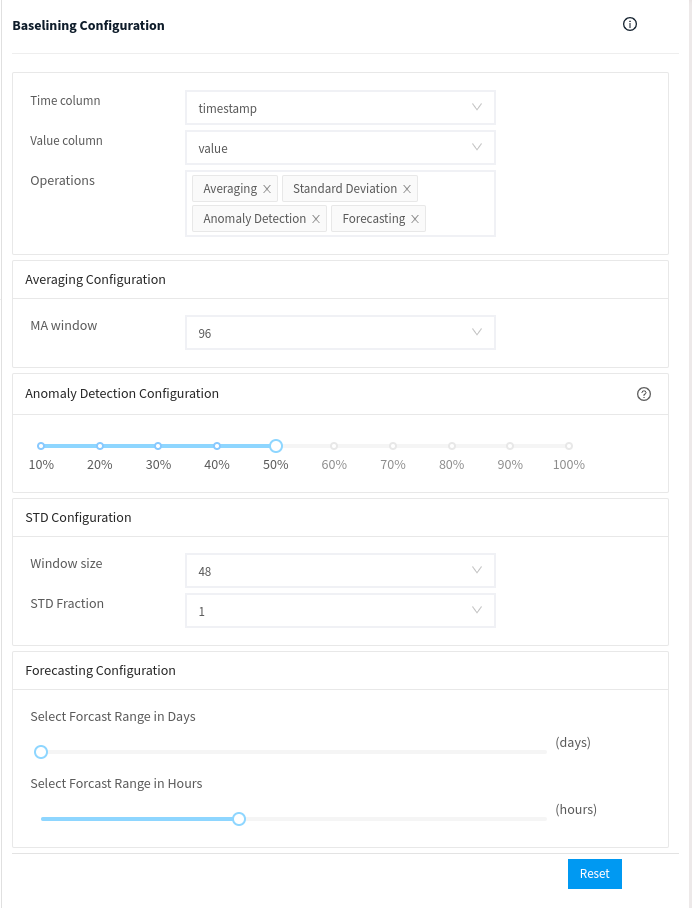

# Time Series Insights

Apica Ascent's baselining feature studies the query data in time series format using machine learning algorithms to implement Anomaly detection and forecasting of the data based on historical data. This feature also includes the mathematical implementation of moving averages and moving standard deviation on the query data. The above feature makes it easy for the user to visualize the behavior of the data from a time-series perspective.&#x20;

This feature can be mainly divided into four categories namely&#x20;

* Anomaly detection
* Forecasting
* Moving Average
* Moving Standard Deviation.

#### Basic Baselining Configuration Guide:

The baselining configuration dialog box appears on the right side of the query page. This configuration mainly needs a time column to indicate the time series data column in the dataset, and a value column to indicate the target value column dependent on the time series. The feature studies the dependent value column from the perspective of the time column and produces the required results which can be visualized using the corresponding meaningful charts. The required baselining features to be implemented are selected from the operations selection box. multiple operation selections can be done at the same time.

