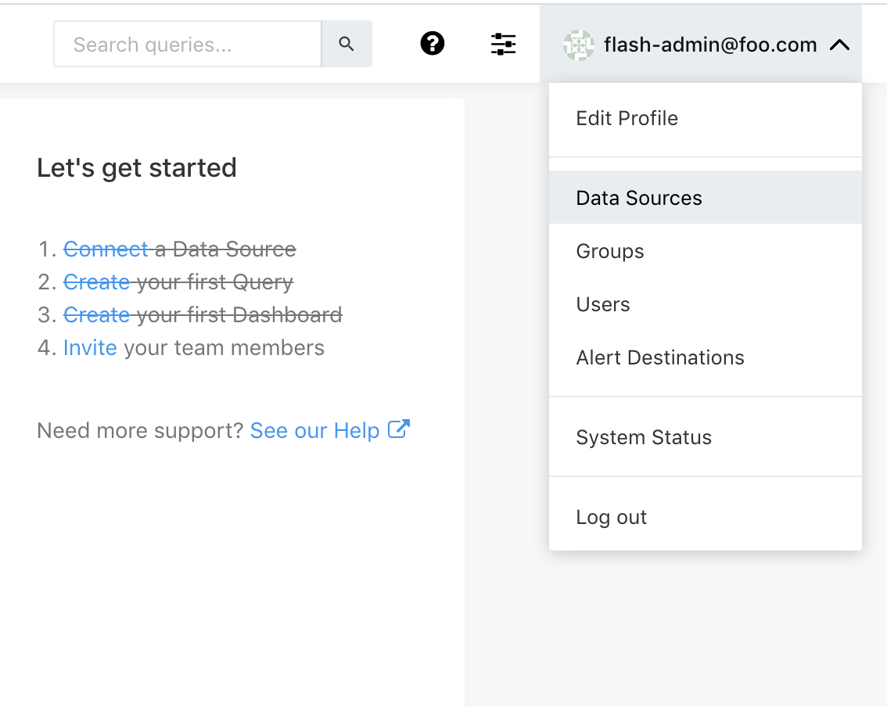

# Quickstart guide

## Configuring Prometheus

LOGIQ monitoring is powered by Prometheus. The steps below assume that your LOGIQ UI is up and running. To connect to your prometheus setup, head over the _Data Sources_ in settings

We are going to click on the _New Data Source_ button

Next, let us select the prometheus Data source from the data sources screen


LOGIQ supports many data sources, LOGIQ's provides tighter integration with Prometheus and uses its time series database for monitoring.


Enter your prometheus data source URL and check the connection by clicking on _Test Connection_


You are now ready to visualize your metrics


