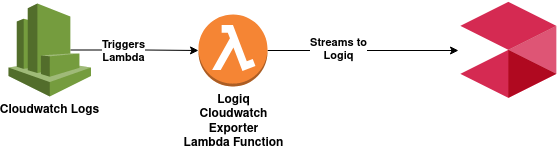

# AWS CloudWatch Exporter

## Logiq CloudWatch exporter Lambda function

Cloudwatch logs can be exported using an AWS Lambada function, the process is as below. AWS Lambda function can act as a trigger for a CloudWatch log stream. 



### Creating Lambda function

Logiq provides a CloudFormation template to create the logiq CloudWatch exporter lambda function. 

```
https://logiqcf.s3.amazonaws.com/cloudwatch-exporter/cf.yaml
```


The same code is available in [client-integrations](https://bitbucket.org/logiqcloud/client-integrations/src/master/cloudwatch-exporter/) git repository


This CloudFormation stack creates a lambda function and its necessary permissions. The following attributes need to be configured.

| Parameter | Description |
| :--- | :--- |
| APPNAME | Application name, A readable name for Logiq to partition logs. |
| CLUSTERID | Cluster ID, A readable name for Logiq to partition logs. |
| NAMESPACE | Namespace, A readable name for Logiq to partition logs. |
| LOGIQHOST | IP address or hostname of Logiq server. |
| INGESTTOKEN | jwt token to ingest logs securely |

## Configuring CloudWatch trigger

Once the CloudFormation stack is created navigate to the AWS Lambda function\(logiq-cloudwatch-exporter\) and add a trigger. 


On the Add trigger page select CloudWatch and select Log Group. 


Once this configuration is complete, any new logs coming to the configured CloudWatch Log group will be streamed to the Logiq cluster

