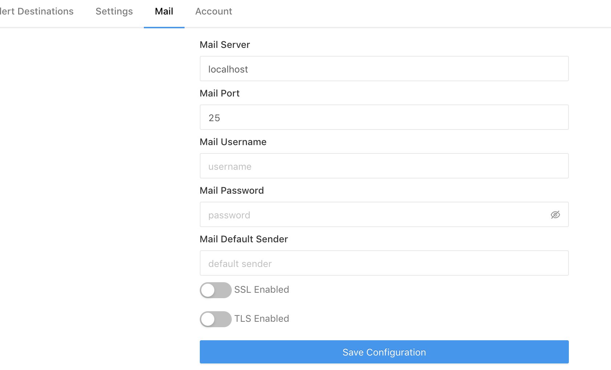

# Email Configuration Setup

LOGIQ insights can be configured to send emails to notify alerts. It uses smtp mail and requires following information for configuration:

1. Mail Server
2. Mail Port
3. Username
4. Password
5. Default Sender

The following attributes can be setup by LOGIQ admin on UI.

