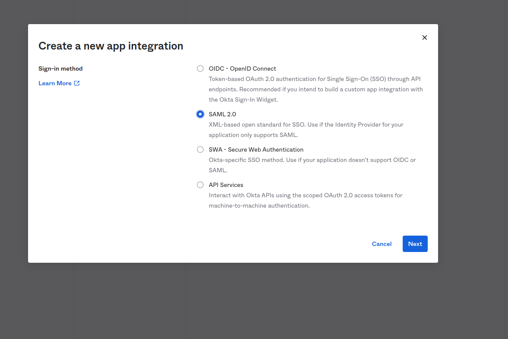
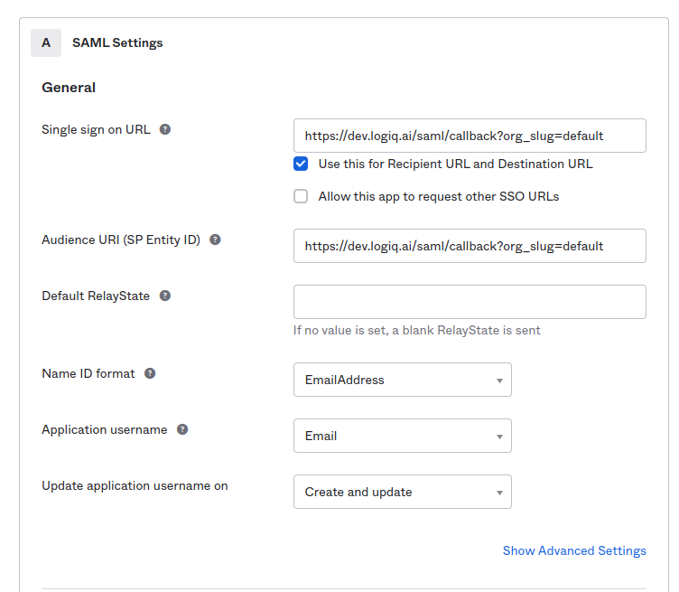
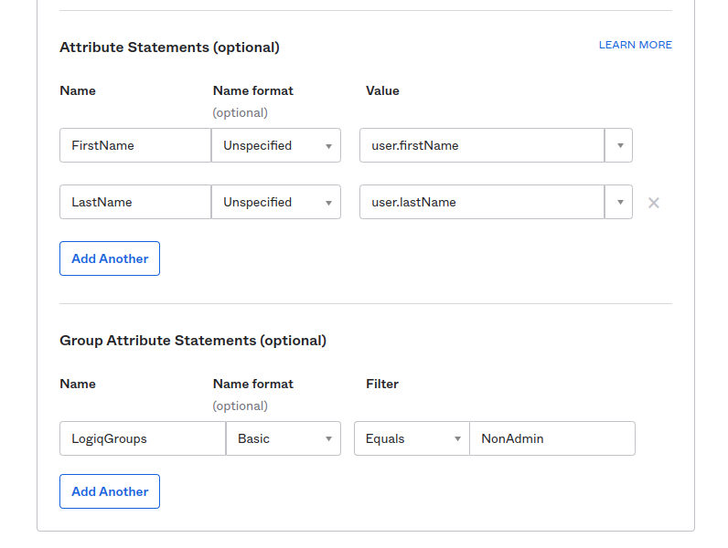
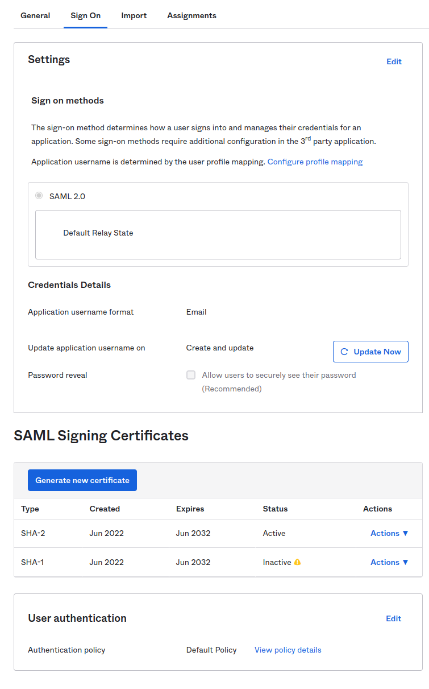
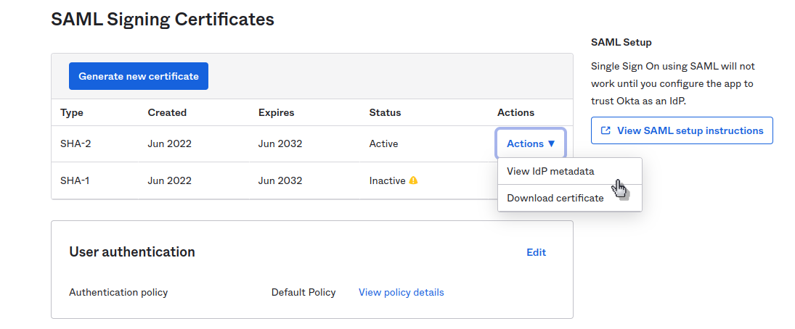
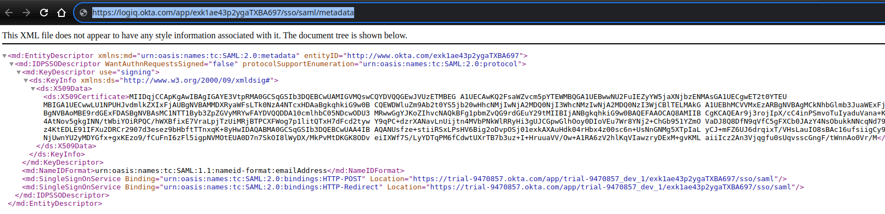
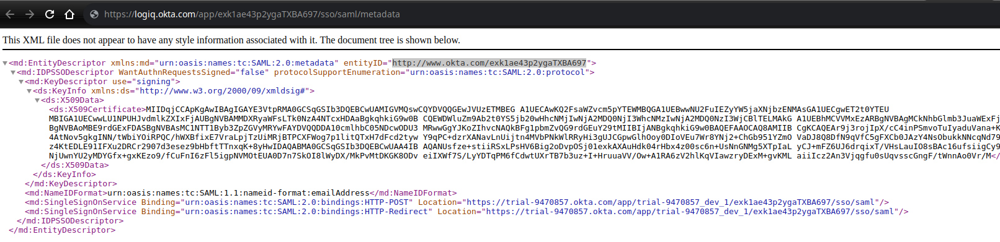
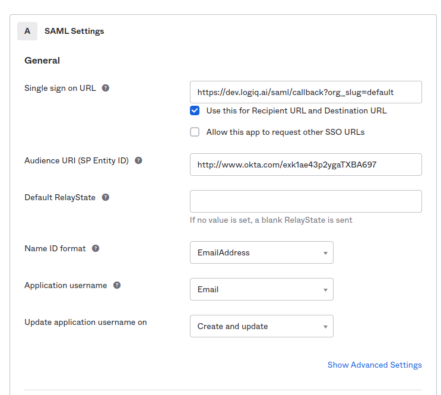
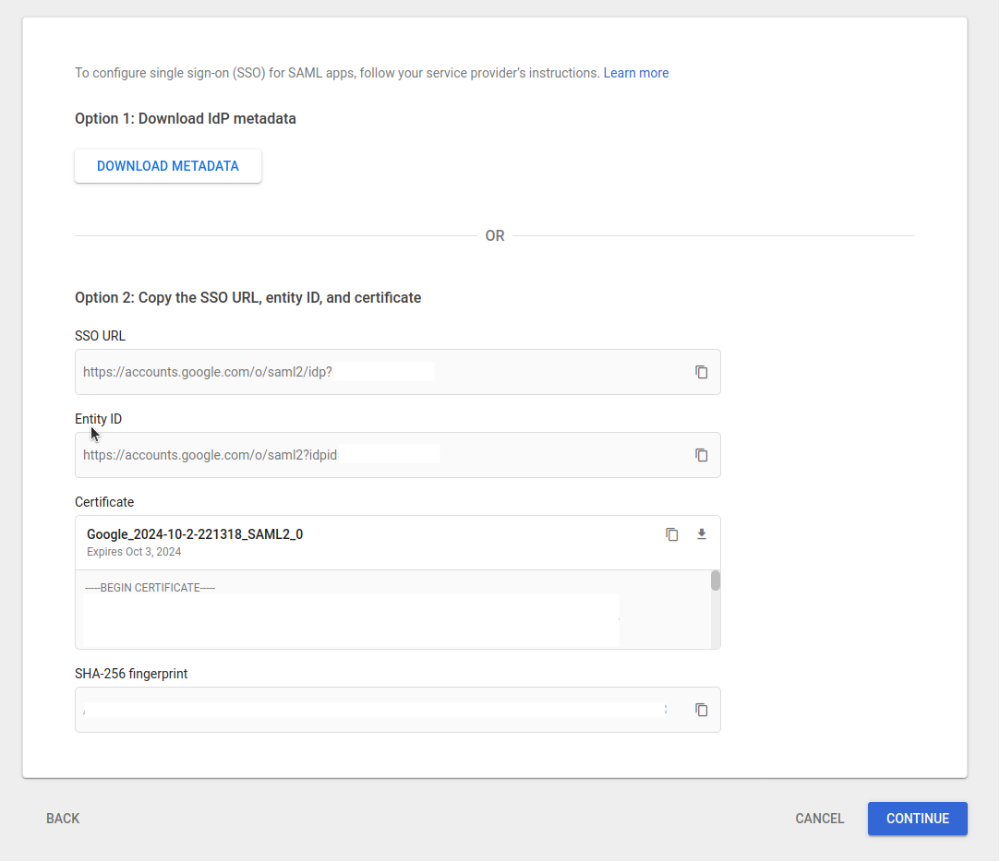

# Single Sign-On with SAML

Apica Ascent can be set up for user login using Single Sign-On (SSO) with SAML by configuring Apica Ascent as Service Provider(SP) and OKTA, Google, or in general any SAML2.0 compliant identity provider (IDP). This is a two-step process.

## Enabling SAML

Login with your admin credentials. Click on `Settings` menu. Enable _"SAML configuration"_ checkbox.\
Add SAML **Metadata URL, Entity ID, NameID Format.**

Check below for specific [steps for your Identity provider](single-sign-on-configuration.md#idp-configuration)

If user-groups are configured on the IDP side, create the identical user groups in Apica Ascent. This can be done by clicking on the "_Settings"_ menu and going to the Groups tab. This example shows creating the "NonAdmin" user group.

\
This concludes the Apica Ascent side configuration.

Logout as Apica Ascent admin. On the login screen, the "SAML Login" Button should be available to login with the user's SSO credentials. By clicking the button browser is redirected to the IDP screen where the user can log in using its IDP credentials.

## IDP configuration

This document provides detailed information to configure OKTA and Google as Identity providers. For other identity providers, please refer to identity providers' documentation. In your IDP application, provide the SAML Assertion Consumer Service (ACS) URL for your Apica Ascent environment and attribute mappings

The following attributes are required. The Apica Ascent mappings for each of the attributes are in brackets. Please use the correct attribute name otherwise Apica Ascent will not be able to recognize the SAML assertion

* First name (FirstName) and Last name (LastName)
* Group name (ApicaAscentGroups)

Use following SAML Assertion Consumer Service (ACS) URL


_https://**\<Apica Ascent UI IP/Domain>**/saml/callback?org\_slug=default_


With this, you should be able to access a SAML metadata URL or SAML metadata file.

### Okta Configuration

This section describes the Okta configuration in detail. Users should assume the Okta admin role and start in the Okta control panel by clicking the button to add a new application. The sign-on method is **SAML 2.0**.

On the next screen, OKTA has fields for a few URLs:

* Single Sign-On URL
* Recipient URL
* Destination URL
* Audience Restriction

Use your Apica Ascent endpoint url in following format:\
https://\<apica-ascent-domain-name>/saml/callback?org\_slug=default\
\
Set Name ID format: **EmailAddress**\
Application username: **Email**

**Configure Attribute statements:**

| **Name**  | **Name Format** | **Value**      |
| --------- | --------------- | -------------- |
| FirstName | Unspecified     | user.firstName |
| LastName  | Unspecified     | user.lastName  |

By default, any user that is created with SAML/SSO will join the default user-group in Apica Ascent. It’s possible to configure OKTA to pass groups the user should join by setting the **`ApicaAscentGroups`** parameter with the intended group name. For example, if the SAML user is a member of the NonAdmin group in Okta, at the user login, the user will be authenticated and added to "NonAdmin" group.


The `default` group in Apica Ascent has access to all data sources. It is highly recommended to create a group assignment for your users and configure `ApicaAscentGroups` as described above. This allows RBAC policies and limits access to what data a user can access


\
**Configure Attribute statements:**

| **Group Name**        | **Name Format** | **Value**        |
| --------------------- | --------------- | ---------------- |
| **ApicaAscentGroups** | Basic           | Equals: NonAdmin |

Continue to create the application as guided by OKTA instructions. Once the application is successfully created, the page will navigate to the **Sign On** tab.

Here choose the **SHA-2** certificate and click on the **Actions** button and choose the **View IdP metadata** option.

This will open a new tab. Here take note of the following information. This is **needed to configure Apica Ascent.**

1. **SAML Metadata URL**: "Identity Provider Metadata" URL depicted below in blue can be copied as a SAML metadata URL or the whole contents of the page can be stored somewhere on the cloud and the path to that file can be used as SAML metadata URL

2\. **Entity ID**: On the same page shown in the above snapshot, You can find Entity ID.

3\. **NameIDFormat**: NameID can be found in the SAML metadata by searching NameIDFormat, shown as selected blue text in the picture below.

.png>)

Navigate back to the app and edit "**Audience Restriction**" and set it with the IDP issuer described in #2 above.

If already not there, create users and user groups such as`NonAdmin` in this example. Users and user groups can also be brought in with inbound federation with ADFS or other identity providers.\
Assign the users to the Application or group such as `NonAdmin` in this example to the Application. This concludes the IDP side configuration.

### Google GSuite Configuration

Navigate to Admin Console and go to the "Web and mobile apps" section

.png>)

Click on "Add custom SAML app"

.png>)

Fill in the "App details"

.png>)

Download the Idp Metadata file and host the file in a publicly accessible location like AWS S3.

Enter the service provider details

* ACS URL is the Apica Ascent domain assigned to you appended with **`/saml/callback?org_slug=default`**
* Choose Name ID format as `EMAIL`
* Name ID as `First name`

<figure><figcaption>
SAML Configuration for gsuite
</figcaption></figure>

In the attributes section, either map a "Google Directory attributes" or Group membership to `ApicaAscentGroups`.

<figure><figcaption>
Configure SAML Attribute for Apica Ascent Groups
</figcaption></figure>

SAML app by default is disabled in Google, enable it and wait for a few minutes and try logging in.

.png>)

Next head over to the Apica Ascent SAML configuration screen in the settings. Select "SAML Enabled", and fill in the details.

.png>)

Now you are ready to use SAML Login, Logout, and log back in using the SAML Login option.
