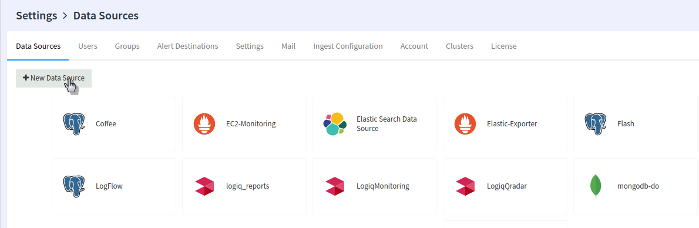
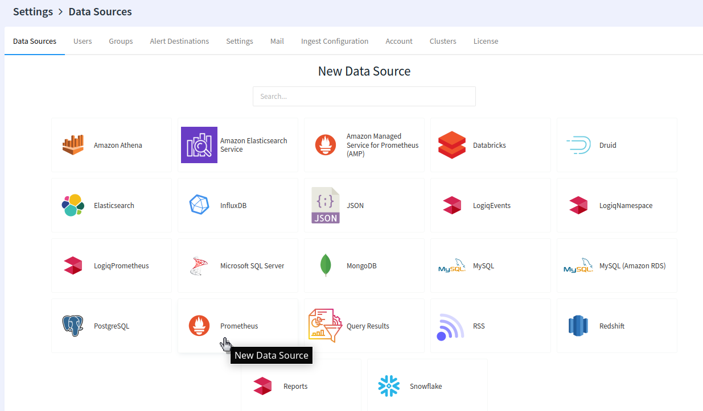

# Overview

LOGIQ monitoring is powered by Prometheus. LOGIQ offers various ways to bring your monitoring data into the platform.&#x20;

* [Prometheus Remote Write](../prometheus-remote-write.md)
* Prometheus Datasource
* Amazon Managed Service for Prometheus (AMP) Datasource

The steps below assume that your LOGIQ UI is up and running. To connect to your Prometheus setup, head over to the _Data Sources_ in settings. Settings can be accessed by clicking on the user name on the left navigation bar.&#x20;

.png>)

Next, let us select the Prometheus Data source from the data sources screen

