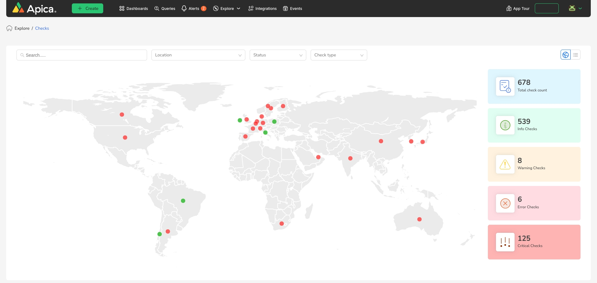

# Map View

The map view of checks provides an overview of all the checks integrated with ASM. If the ASM tenant is enabled, this page will serve as the default home page for the user. This view allows for quick and efficient monitoring of system health and performance at a glance.

<figure><figcaption></figcaption></figure>

Hovering on an individual check will show you the count and status of all the checks on that location.

<figure><figcaption></figcaption></figure>

clicking on the marker will take you to the list view showing the details of that location and highest state checks.
