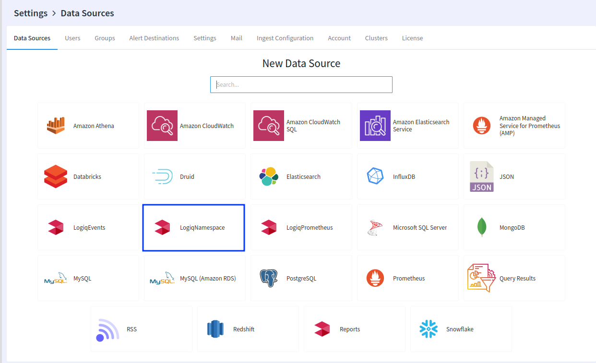

# Configuring RBAC

## Overview

Apica Ascent, not only supports access to logs but also to additional data sources. Apica Ascent's RBAC enforcement works by restricting access to the data source. This in turn translates to restricting user access to queries and dashboards created on those data sources.

In addition, Apica Ascent's log collection model works by mapping incoming log data into [namespaces](logs-terminology.md#namespace). In Apica Ascent, a [namespace](logs-terminology.md#namespace) is treated as a data source, thus allowing a uniform model for applying access restrictions.

## Creating a namespace data source

Namespace restrictions are managed by the namespace data source. Only the admin users have privileges to access and modify data sources.

In the data source configuration, provide the data source settings by listing out the namespaces that are part of the data source definition. Provide a name for the data sources and then Save your configuration. In the example below, we are creating a NonAdmin-Namespace data source that has access restrictions to two namespaces `flash:advertise` and `prod-k8s:kube-system`

## Assigning Namespace data sources to users

The final step is to attach the namespace data source to a group. This restricts all users in the group to the namespaces defined in the data source.

## Managing access to namespaces from multiple clusters and hosts

Namespaces in Apica Ascent map to virtual hosts or namespaces in Kubernetes clusters. Resources such as ECS clusters can also be mapped to namespaces.

Let us look at how this works in practice. In the example above, the access restrictions are applied to two namespaces `flash:advertise` and `prod-k8s:kube-system`

The user will be able to access only these 2 namespaces whether it may be **View Only** access or **Full-Access**

Yes, it is that simple!
