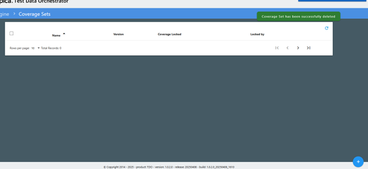

# Create Coverage Set

A Coverage Set is a fixed collection of Determining Attributes that are used to build specific Business Rules for a series of tests.  Only determining attributes defined in your selected project can be used to build your coverage set.


Coverage set object names must end in ‘\_coverage’.


To create a coverage set, select ‘Coverage Sets’ from the ‘Coverage Engine’ section of the menu.  You can select an existing coverage set by clicking on the blue check mark to the right of the coverage set name.

To create a new coverage set, click on the blue plus (+) sign in the lower right-hand corner of the screen.  The ‘Create Coverage Set’ window will open.

<figure><figcaption>
Coverage Sets Page
</figcaption></figure>

Start by giving your coverage set a name in the top pane. Then in the second pane, start to type the name of the determining attribute(s) you want to add to your coverage set. Once you have typed in a few letters, TDO will bring up a list of matching determining attributes. Click on the attribute you want to add to move it to the list in the third pane. Continue this for all attributes you want to add.

<figure><figcaption>
Adding a Determining Attribute to the Coverage Set
</figcaption></figure>

This is the view of the completed coverage set.

Note that in the business rules page (next section) the determining attributes will appear in the order that they are listed on this screen.  You can re-order the attributes list to make the business rule easier to navigate.  To move an attribute, click on it and drag it to the desired position in the list.

<figure><figcaption>
List of Determining Attributes in Coverage Set
</figcaption></figure>

To save the coverage set, click ‘Save’ in the top pane. Select the coverage set to work with by clicking the blue check mark to the right of the coverage set.

Coverage sets can be edited to add or delete determining attributes.  When you edit the coverage set (for example, to add a new determining attribute) TDO will apply version control and you will see both your existing coverage set and new coverage set in the list.  Also note that any business rules associated with the original coverage set will be added to the new coverage set.  If a determining attribute was added, the new determining attribute will be blank and will need to be selected by editing the business rule.  If a determining attribute was deleted it will not appear on the business rule screen.

<figure><figcaption>
Original coverage set selected
</figcaption></figure>

<figure><figcaption>
Business rules associated with original coverage set
</figcaption></figure>

<figure><figcaption>
New version of edited coverage set at bottom of list
</figcaption></figure>

<figure><figcaption>
Business rules for new version with determining attribute added
</figcaption></figure>

Coverage sets can only be deleted by users with Admin rights.  Non-admin users will not see the delete icon.  Deleting a coverage set will delete objects that are part of the coverage set (business rules).
