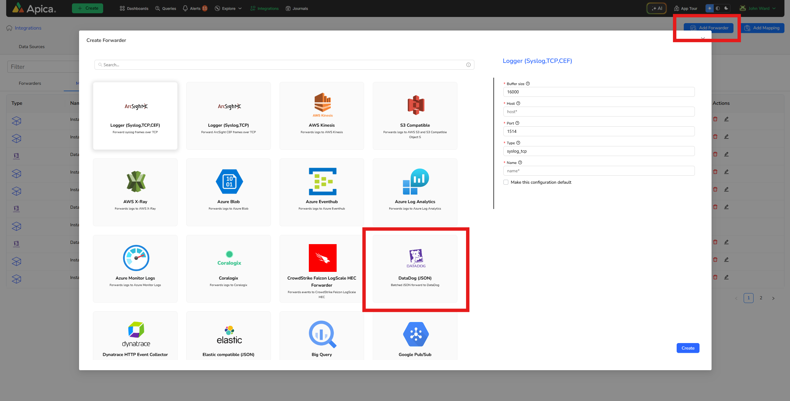

# Ascent Overview

## Welcome to Apica Ascent

Apica Ascent is a powerful full-stack Telemetry Data Management and Observability platform designed to streamline and optimize your entire data life-cycle: **Collect**, **Control**, **Store**, and **Observe**.

### Observability Data Lifecycle

The **Apica Ascent platform** consolidates observability data into a single platform, focusing on **(M)etrics, (E)vents, (L)ogs, and (T)races**, commonly known as **MELT** data. This integrated approach to MELT data is crucial for efficient root cause analysis. For example, if you encounter an API performance issue represented by latency metrics, being able to drill down to the API trace and accompanying logs becomes critical for faster root cause identification. Unlike traditional observability implementations, where data sits in separate silos that don't communicate, Apica Ascent ensures a cohesive view of all MELT data, leading to faster root cause outcomes.

This makes the **Ascent platform** a reliable first-mile solution for consolidating **MELT** data within your enterprise environments. Experience a seamless, fully integrated observability solution that enhances performance and efficiency across your infrastructure.

<figure><figcaption></figcaption></figure>

### Capabilities

Apica Ascent employs a unified view of your enterprise, utilizing a full-stack approach to observability data life cycle management. By seamlessly integrating various capabilities, Apica Ascent facilitates a smoother and more effective root cause analysis process.

<figure><figcaption></figcaption></figure>

### Communities and Compliance

Apica Ascent takes pride in its commitment to security and compliance. The platform adheres to SOC 2 Type II Compliance standards and is an esteemed member of the Cloud Native Computing Foundation (CNCF).

|                                  |                                           |                                                                               |
| -------------------------------- | ----------------------------------------- | ----------------------------------------------------------------------------- |
|  |  |  |
