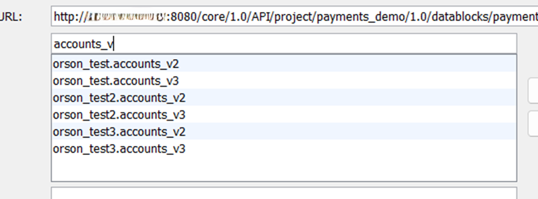
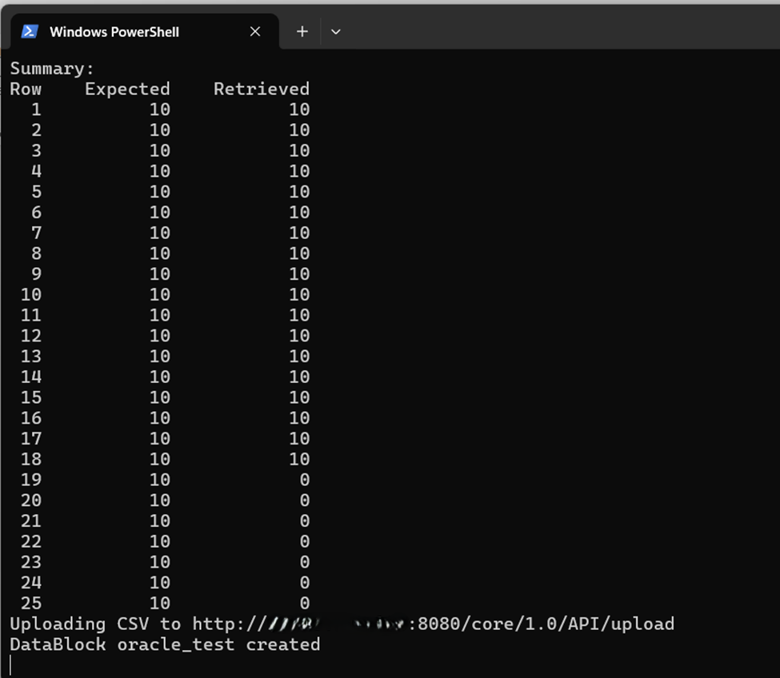

# Extracting Data

## Orson Test Data Orchestrator

### Test Data Extractor (TDX) User Guide

### Setting up the Extract

Before we start working with tables it is important to understand that when you access a schema you will have access to all of the tables / databases in that schema.  TDX allows you to work within a single database, or in multiple databases within the schema.  The important thing is to make sure that there are common fields between the tables you select so that the data can be ‘connected’ via a where clause during extraction.&#x20;

&#x20;This may be through a single key field shared by all tables. It may also be through multiple key fields (i.e., table A and table B share field 1; table B and table C share field 2).

&#x20;Next, we will set up the extraction process.

&#x20;In the DB Tables section, click on the name(s) of the tables you want to work with to build your extract, then click the ‘>’ button to move them to the right side.  When you do this, the fields in those tables will automatically populate in the ‘Attributes to Select’ window below the table names on the left side.

&#x20;To remove a table from the selection list, click the ‘<’ button.&#x20;

<figure><figcaption>
Selecting database tables
</figcaption></figure>

&#x20;You can also search for a table name, in the field above the list of tables, start to type the name of the table (or a word in the table name).  This list of tables displayed will be reduced to only those that match what you have typed in.

&#x20;You can perform the same type of search on the list of fields (attributes) below the DB Tables section, and you can perform this search on both the left (available) and right (selected) sections.

&#x20;

&#x20;

<figure><figcaption>
Table Search by Key Word
</figcaption></figure>

Now you can select the list of fields you want to include in your extract.  Note that you don’t need to include all the fields in the selected tables but only those fields you need to populate the output data file(s) in TDO.  Use the right (>) and left (<) arrows to select/remove the fields from the right-hand side of the window.

&#x20;This is how the list should look after fields are selected:

&#x20;

<figure><figcaption>
Field selection block
</figcaption></figure>

&#x20;Note that tables and fields will only show in one list – available (left) or selected (right).

### Creating Selection Criteria

To create your selection criteria, you will be working in the ‘Coverage Matrix Criteria’ section of the TDX screen.  This section has two parts.  The top part is a line with a drop down list of fields, a drop down list of operators, a drop down list of the determining attributes from the coverage matrix, an ‘Add’ and ‘Remove’ button, and a ‘Row count per condition’ drop down list.

&#x20;

We will start with the database field to be matched to the coverage matrix.  Click on the drop down and select the field you want to match to your determining attributes.  Note that all fields from your selected tables are available for matching to your determining attributes, even if you are not including them in your data extract.  For example, in the screen print below, ‘principal’ is highlighted, even though it’s still in the ‘available’ (left) side of the screen in the above screen print.  Any field in any of your selected tables can be used to match to your determining attributes as part of your selection process.

&#x20;

To match a field to a determining attribute, select a field from the database fields drop down, select an operator from the operator drop down, then select a determining attribute from the attribute drop down.  Click ‘Add’ to add that rule to your rules list.

&#x20;

Available operators are = (equal), <> (not equal), > (greater than), < (less than), >= (greater than or equal to), <= (less than or equal to), and ‘like’ (when the field contains the determining attribute string as part of it’s contents).

&#x20;

<figure><figcaption>
Matching fields to criteria - selecting the field
</figcaption></figure>

&#x20;

You can add one or more rules.  You must use at least one rule but are not required to use every determining attribute from your coverage matrix as part of the criteria.  A completed list of selection criteria is shown below:

&#x20;

<figure><figcaption>
Sample rules for data extract
</figcaption></figure>

&#x20;

The ‘Row count per condition’ field is used to manage the quantity of data you extract.  If you select 1, then for each row in your coverage matrix TDX will retrieve exactly one matching item from your source database.  In the screen print higher up, TDX has a row count of 10.  In this case, if the coverage matrix has 24 rows, then TDX would retrieve 240 rows of data (10 matching data items for each row in the coverage matrix).  This allows you to assemble data for more than one round of testing before performing a new extract.

&#x20;

### Identifying Table Joins / Key Fields

If you are extracting from two or more tables, TDX needs to know how those tables should be joined.  This is done in the ‘Where clause’ line below the selection criteria.  In the sample where statement below, the ‘customer\_id’ field in both the accounts and customers table is used as the common field between the two tables.

&#x20;

<figure><figcaption>
Example of table join criteria
</figcaption></figure>

&#x20;

Any SQL statement can be included in this line.  More than two tables can be joined if all of the tables are logically joined.  For example, let’s say we also had a ‘branches’ table used, and the ‘branch\_id’ was in both the accounts and branches table.  Our where clause would then read _orson\_test.accounts.customer\_id = orson\_test.customers.customer\_id AND orson\_test.accounts.branch\_id = orson\_test.branches.branch\_id_.

&#x20;

Also note that a one-to-one relationship is not required.  In the example above, each customer appears once in the customers table but can appear multiple times in the accounts table.  Each account will be matched only once, but a customer might have multiple accounts selected for testing.

&#x20;

### Extracting Data

Once all these items are filled in, your screen will look similar to this:

&#x20;

<figure><figcaption>
Completed Data Extract Profile
</figcaption></figure>

Before extracting, it is recommended that you save this profile so that you can reload it when needed.

&#x20;

When you are ready to extract, click the ‘Extract Data’ button.  A progress window will pop up.  Once the extract is completed, a message will inform you that the data block is ready.  Click the ‘OK’ button to proceed.

&#x20;

<figure><figcaption>
Extract complete message
</figcaption></figure>

&#x20;&#x20;

Before going to TDO to view use the extracted data, you can view the run data in the terminal window to see how the extract progressed.  (You may have to scroll up to see the ‘Executing query’ portion of the log.)

&#x20;

<figure><figcaption>
Generated SQL query in terminal window
</figcaption></figure>

This shows the generated SQL query that was executed.

&#x20;At the bottom of the log, you will see a list of how much data was retrieved on a row-by-row basis.  The coverage matrix used for this example has 25 unique rows. For rows 1 through 18, 10 matches were expected, and 10 were found and retrieved.  For rows 19 – 25, no data was available that matched the criteria in the coverage matrix.

&#x20;This can occur for several reasons.&#x20;

·       You are testing a new / newer feature and data for that condition does not yet exist in your test environment.

o   In this case, you would need to create data to match the tests or refresh your test environment.

·       Your conditions in your coverage matrix are not set right.

o   Go back into TDO and check your business rules to make sure that the data is properly defined.

·       Your operand in TDX matching your database field to the coverage matrix is not set right.

o   In TDX, look at your rules.  If necessary, remove the bad rule and create a new one.

&#x20;&#x20;

<figure><figcaption>
Extract : Expected vs. Actual
</figcaption></figure>

You will also notice that at the bottom of the log, the datablock name (that you defined) is shown as uploaded to TDO, and the url for the selected TDO instance is also shown.

&#x20;

### Troubleshooting

If the data extract does not process, you will see the errors in the log file.  Scroll up to the initial SQL statement.

&#x20;

Instead of ‘Executing query…’ and ‘Binding…’ you will see bind error statements if the SQL statement generated by TDX cannot bind to the tables.  If you see these errors, there is an error in your selection rules, your where statement, or your coverage matrix.&#x20;
