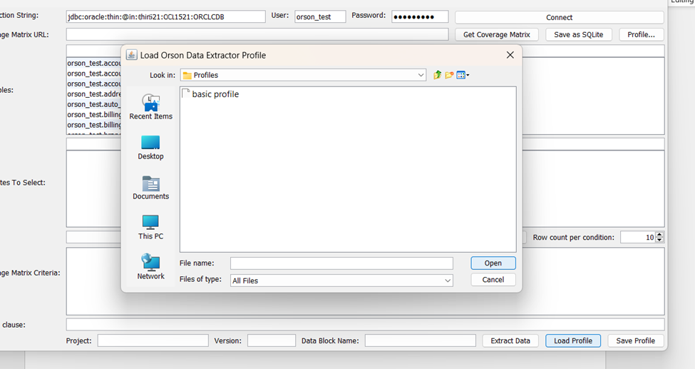

# Setting up a Data Profile

## Orson Test Data Orchestrator

### Test Data Extractor (TDX) User Guide

### Create an Initial Profile

Enter the connection string for your database in the ‘Connection String’ field in the top right section of the page.  Enter the User ID and Password for the database in the User and Password fields.

&#x20;

If you do not have the connection string, contact your database administrator to get the proper string.&#x20;

&#x20;

You must have, at a minimum, read access database credentials (User ID and password) to access the database.  If you do not have these credentials, follow your organization’s approved process for obtaining them.

&#x20;

Click ‘Connect’ to connect to the database.  You will see the list of tables that your User

ID has access to in the left side of the ‘DB Tables’ section when the connection is established. If you cannot see what you are looking for, you may need to require extended access privileges to additional tables or schemas.

&#x20;

&#x20;

<figure><figcaption>
Database connection
</figcaption></figure>

### Saving a Profile

At this point, you should save this as your basic connection profile.  At the bottom right of the window, click on the ‘Save Profile’ button.  A standard file saving dialog box will pop up.  Select the directory you want to save the profile in (Data Extractor/Profiles is the recommended directory) and give the file a name (e.g.: basic profile).&#x20;

&#x20;

File type of XML is already chosen by the application; do not modify this.

&#x20;

Click ‘Save’ to save this profile.

&#x20;

Saved profiles make loading work easier, as you do not need to remember the database connection string.

&#x20;

Note that TDX does not save the User ID or password in the profile; you will need to provide this each time you load a profile.

<figure><figcaption>
File dialog box
</figcaption></figure>

&#x20;

### Loading a Saved Profile

At the bottom right of the TDX window, click on ‘Load Profile’.  A file open window dialog will open.  You may need to navigate to the subdirectory where your profiles are saved.&#x20;

&#x20;

If you do not see any saved profiles, change the ‘Files of Type’ field from ‘XML files’ to ‘All Files’.

&#x20;

Click on your profile name to select it and click ‘Open’.

&#x20;

TDX will prompt you to enter the User ID and password for the database.

&#x20;

<figure><figcaption>
Opem Profile Dialog
</figcaption></figure>

### Setting up an Extract Profile

To extract data, enter the URL for your desired coverage matrix in the ‘Coverage Matrix URL’ field at the top right, just below the database credentials line.

&#x20;

Your URL will be in the format:

&#x20;

http://\<server\_name>:8080/core/1.0/API/project/\<project\_name>/\<ver\_no>/datablocks/\<cov\_matrix\_name>/\<ver\_no>/

&#x20;

Here is an example of the coverage matrix retrieval URL:

&#x20;

[http://52.512.68.75:8080/core/1.0/API/project/payments\_demo/1.0/datablocks/payments\_coverage/1.0/](http://35.214.71.106:8080/core/1.0/API/project/payments_demo/1.0/datablocks/payments_coverage/1.0/)

&#x20;

Note that this could be http or https, depending on how TDO is loaded in your environment.

&#x20;

The server name could be in multiple formats, including an IP address, ‘localhost’, or a VM or server name.

&#x20;

The project name and the coverage matrix name are the ones used in TDO.

&#x20;

Once the coverage matrix name is entered, click on the ‘Get Coverage Matrix’ button to the right of the URL.&#x20;

&#x20;

To confirm that the connection to the coverage matrix is established, look in the center box below the ‘Attributes to Select’ section of the window.  You should be able to click on the dropdown box and see all of the determining attribute names from your coverage matrix.

&#x20;

&#x20;

<figure><figcaption>
Coverage matrix attributes populated in drow-down box
</figcaption></figure>

Next, we will tell TDX where to put the extracted data and what name to give the data block.

&#x20;

On the bottom row, enter the project name, project version, and data block name for your extract.  Generally speaking, the project name and project version will be the same ones used in the coverage matrix URL.  The data block name should be one that is easy to identify as coming from your extraction.  Finally, remember that all file names in TDO must be lower case with underscores instead of spaces.

&#x20;

<figure><figcaption>
Identifying target project, version, and data block name
</figcaption></figure>
