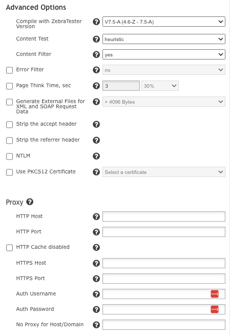
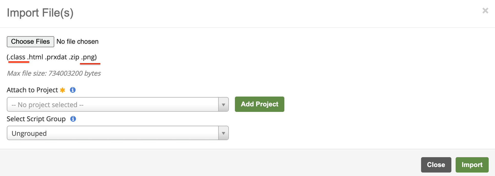
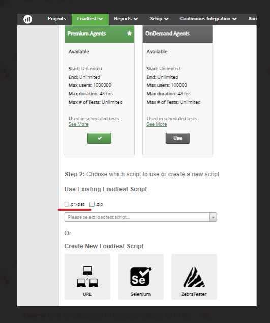
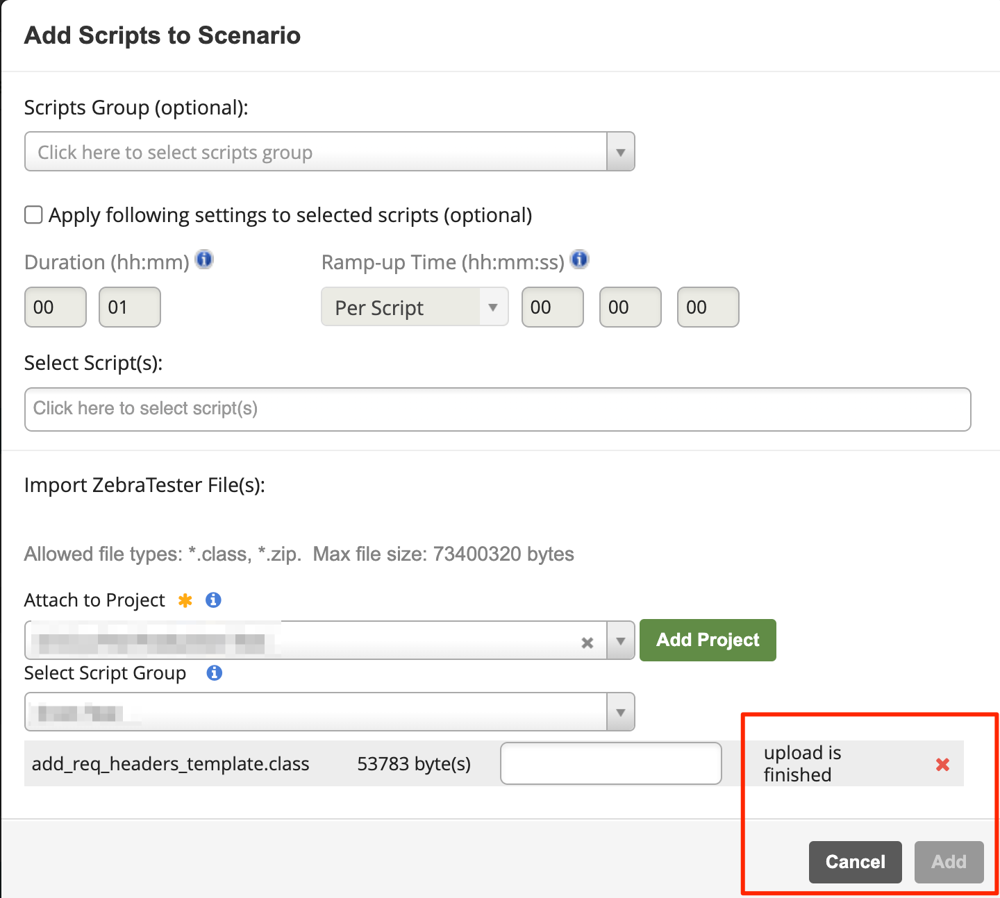

# Loadtesting

## ALT 6.14 Public Release Notes (2024-04) 

This release focuses on security improvements to the API and the login process, as well as a major change in the way users upload ZebraTester scripts.

## User Story Enhancements / Tasks 

### Deprecation of Direct .class File Upload 

* Due to security concerns, users will no longer be able to upload compiled ZebraTester .class files to the ALT platform. ZebraTester scripts are now required to be uploaded as a .prxdat file or as a .zip file with a .prxdat file included if the file contains external resources (such as load test plugins). The uploaded .zip or .prxdat will be compiled by the ALT platform into a .class file or a .zip which contains the necessary class file.
  * Users will now have the option to specify compilation options when they upload a .prxdat or .zip file, in the same way as when they upload via the ASM portal:

<figure><figcaption></figcaption></figure>

These compilation options will be available wherever it is possible to upload a script into ALT.

* We have implemented a setting which allows Root users to continue to upload .class files. This setting is enabled or disabled on an account level; contact your TAM if you still have the need to upload compiled .class files to the ALT platform.

### Security Improvements 

* Numerous other security improvements pertaining to the ALT API
* We have implemented reCAPTCHA v3 in order to defend against potential brute force attempts. If a user tries and fails to login 5 times, a reCAPTCHA will be displayed and a verification code will be sent to the user to verify the login attempt
* The notification of a failed login attempt no longer indicates whether or not a given user exists
* Implemented HSTS on the ALT web server, forcing users to connect via HTTPS
* Active user sessions will now be invalidated after a password is changed or reset

### Other 

* SSO login has been moved to the same page as local login
* The .class and .png file types will be removed from the “Import File(s)” dialog in the Script Manager:

<figure><figcaption></figcaption></figure>

References to .class file uploads will be removed site-wide unless .class file upload has been allowed on an account level (see “Deprecation of Direct .class File Upload” above)

## Bug Fixes 

* Fixed an issue which prevented correct filtering of .prxdat files in the Loadtest Script dropdown:

<figure><figcaption></figcaption></figure>

* Fixed an issue with the password recovery email that was sent to certain users upon password reset
* Fixed an issue which prevented users from uploading and adding a ZebraTester script to a Scenario via file upload on the Scenarios page > “Scripts” tab:

<figure><figcaption></figcaption></figure>

After the fix, the dialog box will automatically close after uploading ZebraTester file(s) and the files will be added to the scenario as intended.

Read previous release notes, go to: \
[https://apica-kb.atlassian.net/wiki/spaces/ALTDOCS/pages/870023169/Release+Notes](https://apica-kb.atlassian.net/wiki/spaces/ALTDOCS/pages/870023169/Release+Notes)
