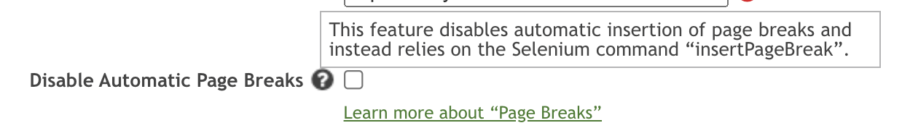
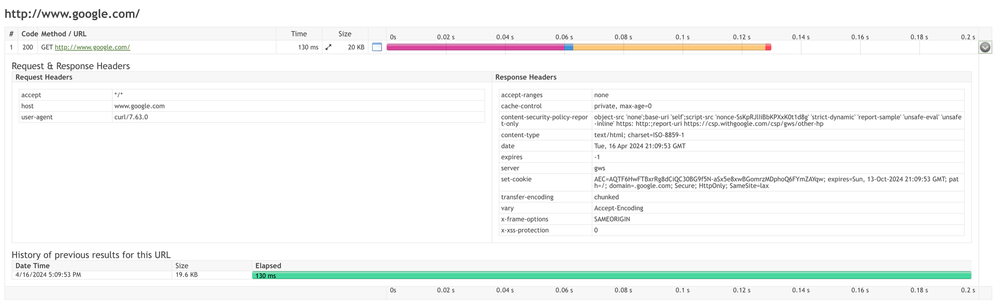

# Synthetic Monitoring

## ASM 13.24 Public Release Notes (2024-04-12) 

## User Story Enhancements 

* Updated the [Compound Check](https://apica-kb.atlassian.net/wiki/spaces/ASMDOCS/pages/2187264091) type to run on the latest infrastructure
* Added a new supported Selenium IDE command, [setLocation](https://apica-kb.atlassian.net/wiki/spaces/ASMDOCS/pages/2135393876/Comparing+Selenium+IDE+Scripts+to+ASM+Scenarios#setLocation)
* Added missing attributes to the response bodies of the [/users](https://api-asm1.apica.io/v3/Help/Route/GET-users) and [/users/{user\_guid}](https://api-asm1.apica.io/v3/Help/Route/GET-users-user\_guid) API GET request endpoints
* Added several new ASM commands to the ASM Manage Scenarios front end. See

for a complete list of supported Selenium IDE commands. Now, all of the commands listed in that article are available in the ASM Edit/Debug Scenarios page

## Tasks 

* ASM users now have the option to disable automatic page breaks when creating Browser checks:

<figure><figcaption></figcaption></figure>

## Bug Fixes 

* Fixed an issue in which checks were not correctly saved when an incorrect inclusion/exclusion period was used and the user was not notified of a reason. After the fix, users will be notified explicitly if their inclusion/exclusion period is incorrect.
* Fixed an issue which prevented custom DNS from being used on the latest infrastructure
* Fixed an issue which prevented an error message from being generated and displayed in the event that auto refresh fails to refresh a Dashboard.
* Fixed an issue which prevented [Power Users](https://apica-kb.atlassian.net/wiki/spaces/ASMDOCS/pages/2133760724) who had limited editing permissions from saving checks. For instance, Power Users who could edit only the name, description, and tags of a check could not save the check after doing so. The bug fix resolved this issue.
* Fixed the following API call: [https://api-wpm.apicasystem.com/v3/Help/Route/GET-checks-proxysniffer-checkId-results-resultId-errorlog](https://api-wpm.apicasystem.com/v3/Help/Route/GET-checks-proxysniffer-checkId-results-resultId-errorlog) which was returning a 500 server error previously.
* Fixed an issue with certain checks which prevented Request & Response Headers from showing correctly within the Check Details page:

<figure><figcaption></figcaption></figure>

* Fixed an issue which prevented API calls from returning correct responses when a new user’s time zone was not set
* Fixed an issue which prevented spaces in between the “accepted codes” field for a URLv2 check:

<figure><figcaption></figcaption></figure>

* Updated API documentation for URL, URLv2 checks to include acceptable "secureProtocolVersion" values
* Fixed an issue with Ad Hoc report generation for certain users
* Fixed issues which prevented Command checks from being created or fetched via the ASM API.

## Epic 

* Disabled the option to select "Firefox" on browser checks
* Disabled location information in the API for deprecated checks
* Disabled old Chrome versions when creating a Chrome check
* Disabled location information in the API for deprecated Chrome versions
* Disabled deprecated check types from the "create new check"
* Disabled deprecated check types from the integration wizard
* Disabled API endpoint for URLv1 checks
* Disabled API endpoint for Command v1 checks
* Disabled deprecated check types from /checks/command-v2/categories
* Disabled deprecated browser version from /AnalyzeUrl
* Replaced Firefox with Chrome when creating an iPhone, iPad, or Android Check in New Check Guide
* Removed deprecated check versions as options from the Edit Scenario page
* Disabled AppDynamics check types from the integration wizard\

Read previous Release Notes, go to:\
[Knowledge Base](https://apica-kb.atlassian.net/wiki/spaces/ASMDOCS/pages/2140241932/Release+Notes)

***

## On Premise ASM Patch 13H.4 Public Release Notes (2024-04-19) 

## User Story Enhancements 

* Added the ability to add/edit “Accepted Codes”, “Port Number” and all “Secure Protocol Versions” for URLv1 checks via the ASM API. API documentation was updated to reflect the new functionality.
* Added SNI (Server Name Indication) support for URLv1 checks

## Bug Fixes 

* Fixed an issue which prevented Power Users with limited check editing permissions from saving checks after performing edits.\

Read previous Release Notes, go to:\
[Knowledge Base](https://apica-kb.atlassian.net/wiki/spaces/ASMDOCS/pages/2140241932/Release+Notes)

&#x20;
