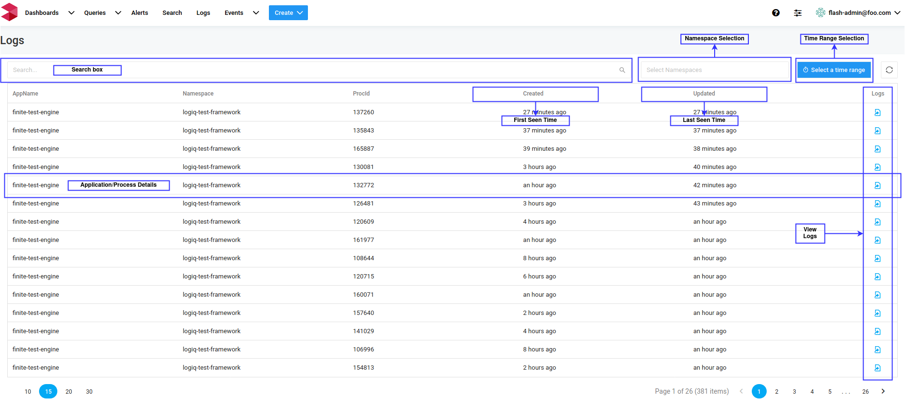
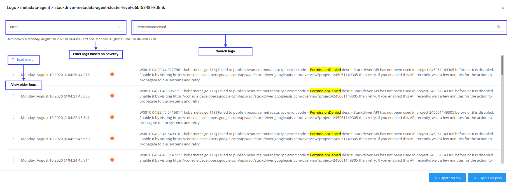
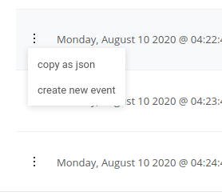

# Logs Page

Use logs page to view the application logs by its processes. Logs table is sorted by the most recent first. Clicking on the View Logs button opens a modal with the most recent logs for the selected process.

The logs modal presents an infinite view of application logs. The modal is loaded with the most recent logs, use the “**Load More**” button to see older logs. The severity drop-down helps to filter the logs based on log level like error, warning, info, debug etc. The search box helps to search through the logs loaded in the modal. The “**Export as CSV**” and “**Export as JSON**” buttons allows export of logs loaded in the modal.

The dots available on each line will reveal additional options to copy individual log lines as json to clipboard and to define an **alertable event** for the selected log line. Refer to events documentation to see how to create events.

