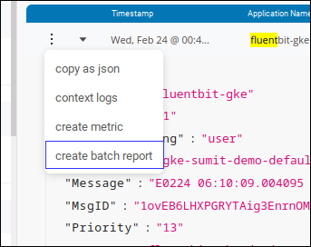
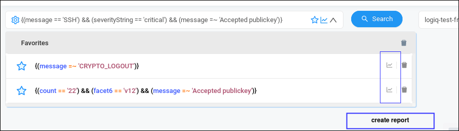

# Reports

Reporting feature comes in handy when required to periodically search and aggregate what is happening in a particular log set. You can create reports in multiple ways:

### Creating a Report

* From the logline, click on "create batch report"

* From the favourites

* From the queries page

Onclick of any of the above options opens the. "Create Reports" modal.

### Aggregation Operators

Following aggregation operators are available.

* sum
* count
* mean
* min
* max
* group

### View Results

Saved reports can be accessed from the Queries Page. If the query is currently running, this page will show the progress. 

Click on any report to view the results. Click on the toggle to enable periodic refresh.

