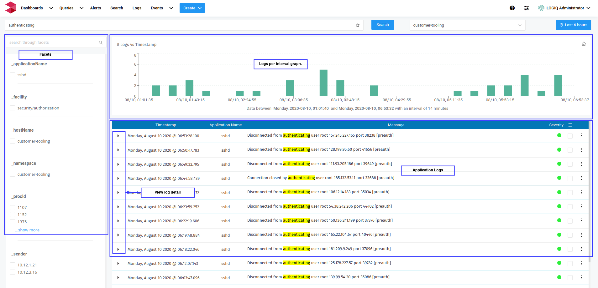
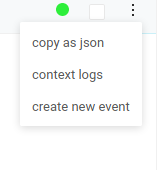

# Search Page

In Search Page, you can:

* Access every log entry in the selected namespace that matches your search pattern
* Filter the search results using Facets
* Get field-level details about the entries that match your search
* Create **Alertable events**
* Export data 

The search happens at the namespace level, select namespace enter the search term to get started. By default, Search shows data for the last 15 minutes. If no data displays, try increasing the time range. Using the time filter, you can specify a common or recently-used time range, a relative time from now, or an absolute time range.

A successful search reveals a graph with a time-series view of logs, a table with facets and logs.

### Filter data using Facets

Use facets to narrow your search results. Logiq's intelligent parsing engine extracts facets at the time of data ingestion. By default selecting a facet only filters the data loaded in the browser. If the data is not available, click on the "apply" button to fetch more results.

### View Log Detail

Expand the caret available in each row to see the log in detail. 

The dots available on each line will reveal additional options to export individual log lines as json and to define an **alertable event** for the selected log line. See [Alertable event ](../logiq-events/alerts.md#creating-an-alertable-event)section.

### Context Logs

When you’ve narrowed down your results to a single log line and now you want to to see the logs around it. You can do that by clicking the context logs option. This brings up the logs modal and you can view the logs from the selected application and process. The log line of interest will be highlighted so that you can look around it.

